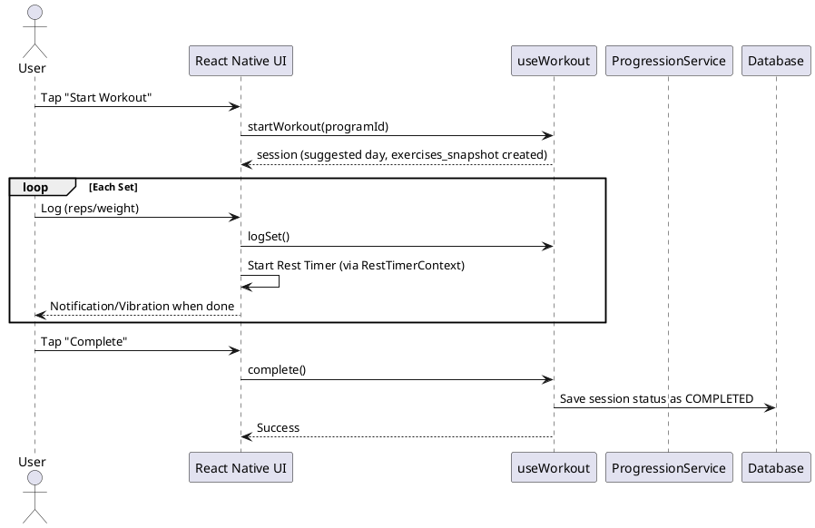
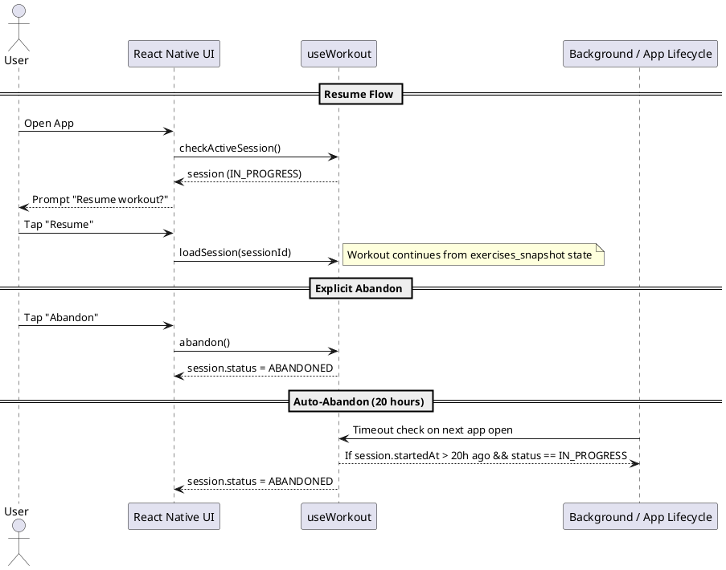

# Config

# Project Configuration - UI & Database

This document outlines the steps to set up and configure the **"Golden Stack"** for Gym Tracker v2: **Expo SDK 52**, **NativeWind v4**, **gluestack-ui v2**, and **SQLite** (via Drizzle ORM).

## 1. The Persistence Imperative

The Gym Tracker v2 is designed as an **Offline-First** application. SQLite is not merely a storage choice but a fundamental requirement for the following reasons:

- **Strict Relational Integrity**: Ensuring that relationships between Exercises, Programs, and Workout Sessions remain consistent through Foreign Key constraints and Cascading deletes.
- **Offline Reliability**: Providing high-performance local storage with ACID compliance for environments with zero connectivity.
- **Structured History**: Maintaining a queryable format for complex aggregations (e.g., progression tracking, volume stats).
- **Data Portability**: Structured storage facilitates predictable JSON export/import cycles, ensuring user data is never locked into the platform.

## 2. Prerequisites & "Golden Stack" Versions

For maximum stability and interoperability in 2025, the following versions are strictly required:

- **Expo SDK**: 52.0.0+ (supports React Native 0.76 with New Architecture)
- **NativeWind**: `4.1.23` (Stable v4; avoid v5 alpha/preview)
- **Tailwind CSS**: `3.4.17` (Avoid v4.0 as it breaks NativeWind v4 plugins)
- **React Native Reanimated**: `~3.16.1` (Most stable pairing for NativeWind v4)
- **gluestack-ui**: v2 (Headless/Copy-paste approach)

## 3. Installation Steps

### 3.1 Styling Engine

Install NativeWind and Tailwind with pinned versions:

```bash
npm install nativewind@4.1.23 tailwindcss@3.4.17 react-native-reanimated@~3.16.1
npx tailwindcss init
```

### 3.2 UI Components (gluestack-ui v2)

Initialize the headless version of gluestack-ui:

```bash
npx gluestack-ui init
```

> **Note**: Choose **NativeWind** as the styling engine. This will create a `components` directory where the source code for UI components will live (Copy-Paste pattern).

### 3.3 Database & ORM

Install the JSI-powered database and ORM dependencies:

```bash
npm install drizzle-orm expo-sqlite
npm install -D drizzle-kit babel-plugin-inline-import
```

## 4. Configuration Files

### 4.1 `tailwind.config.js`

Ensure the `content` array includes the `components` directory generated by gluestack-ui:

```javascript
/** @type {import('tailwindcss').Config} */
module.exports = {
  content: [
    "./App.{js,jsx,ts,tsx}",
    "./src/**/*.{js,jsx,ts,tsx}",
    "./components/**/*.{js,jsx,ts,tsx}", // Added for Gluestack UI components
  ],
  presets: [require("nativewind/preset")],
  theme: {
    extend: {
      colors: {
        primary: { energy: "#4F46E5" },
        surface: { deep: "#121212", elevated: "#1E1E1E" },
        success: { growth: "#10B981" },
        accent: { warning: "#F59E0B" },
        error: { critical: "#EF4444" },
      },
    },
  },
  plugins: [],
}
```

### 4.2 `metro.config.js` (Advanced Combined Config)

This configuration merges the requirements for **NativeWind (CSS)**, **Drizzle (SQL)**, and **SVG Icons**:

```javascript
const { getDefaultConfig } = require('expo/metro-config');
const { withNativeWind } = require('nativewind/metro');

const config = getDefaultConfig(__dirname);
const { resolver, transformer } = config;

// 1. Support for Drizzle ORM (.sql migrations)
config.resolver.sourceExts.push('sql');

// 2. Support for SVGs (gluestack icons)
config.resolver.assetExts = resolver.assetExts.filter((ext) => ext !== 'svg');
config.resolver.sourceExts.push('svg');
config.transformer.babelTransformerPath = require.resolve("react-native-svg-transformer");

// 3. Final Wrap with NativeWind
module.exports = withNativeWind(config, { 
  input: './global.css' 
});
```

### 4.3 `babel.config.js`

Order is critical. Reanimated must be the last plugin:

```javascript
module.exports = function (api) {
  api.cache(true);
  return {
    presets: [
      ["babel-preset-expo", { jsxImportSource: "nativewind" }],
      "nativewind/babel",
    ],
    plugins: [
      ["inline-import", { "extensions": [".sql"] }], // Required for Drizzle
      "react-native-reanimated/plugin", // MUST BE LAST
    ],
  };
};
```

### 4.4 `drizzle.config.ts`

```typescript
import type { Config } from "drizzle-kit";

export default {
  schema: "./src/db/schema.ts",
  out: "./drizzle",
  dialect: "sqlite",
  driver: "expo",
} satisfies Config;
```

## 5. Usage & Best Practices

### 5.1 Synchronous Database Access

Use `openDatabaseSync` to leverage JSI for near-native performance:

```typescript
import { openDatabaseSync } from 'expo-sqlite';
import { drizzle } from 'drizzle-orm/expo-sqlite';

export const expoDb = openDatabaseSync('gym-tracker.db');
export const db = drizzle(expoDb);
```

### 5.2 Running Migrations

Handle migrations in the root `App.tsx`:

```tsx
import { useMigrations } from 'drizzle-orm/expo-sqlite/migrator';
import migrations from './drizzle/migrations';
import { db } from './src/db/client';

export default function App() {
  const { success, error } = useMigrations(db, migrations);

  if (error) return <ErrorView message={error.message} />;
  if (!success) return <SplashScreen />;

  return <MainApp />;
}
```

### 5.3 Component Usage (Gluestack v2)

Import from your local `components` folder, NOT from `@gluestack-ui/themed`:

```tsx
import { Button, ButtonText } from "@/components/ui/button";

export const ActionButton = () => (
  <Button className="bg-primary-energy h-12">
    <ButtonText>Start Workout</ButtonText>
  </Button>
);
```

## 6. Known Risks & Mitigations

| Risk | Mitigation |
| :--- | :--- |
| **New Architecture Bugs** | Test on **Development Builds** (not just Expo Go) early. |
| **Style Flickering** | Ensure `GluestackUIProvider` wraps the root and uses NativeWind v4 `css-interop`. |
| **Large SQLite Writes** | Use `withTransactionAsync` for bulk operations to keep the UI thread smooth. |


---

# Design Doc

# Gym Tracker - Design Document

## 1. Technology (Golden Stack 2025)

| Aspect | Decision | Notes |
| -------- | ---------- | ------- |
| Users | Single-user | Offline-only |
| Platform | Mobile (Expo SDK 52) | React Native 0.76+ (New Architecture) |
| Language | TypeScript | Strong typing across the stack |
| Styling | **NativeWind v4** | Tailwind CSS 3.4 compiled to Native |
| UI Components | **gluestack-ui v2** | Headless / Copy-Paste (Source in project) |
| Persistence | **SQLite (JSI)** | `expo-sqlite` + Drizzle ORM (Synchronous) |
| Architecture | Modern Hooks | TanStack Query + Repository + JSI SQLite |

## 2. UI Design

### Navigation Structure

```markdown
Tab Navigator
├── Home (Start Workout)
├── Programs
├── Exercises
├── History
└── Settings (Export/Import)
```

### Key Screens

| Screen | Purpose |
| -------- | --------- |
| `HomeScreen` | Quick-start workout, show active session if exists |
| `WorkoutScreen` | Active workout: current exercise, set logging, rest timer, progress indicator (e.g., "3/15 sets complete") |
| `ProgramsScreen` | List programs, CRUD operations |
| `ProgramDetailScreen` | View/edit days and exercises |
| `ExercisesScreen` | Exercise library, CRUD operations |
| `HistoryScreen` | Past workout sessions list. Tap an item for detailed view. |
| `SettingsScreen` | Export/Import data, weight unit preference |

### UI Constraints

**Read-Only Fields**: Fields that modify the underlying definition of an entity (e.g., an Exercise's `Default Tracking Type`) must be **greyed out/disabled** when viewed in a descendant context (e.g., within a Program Day list). This clarifies that the user is viewing an instance, not editing the global definition.

**Workout Flow**: Linear execution (Set 1 of Exercise A -> Set 2 of Exercise A -> ... -> Exercise B). After a set is logged, the `RestTimerContext` triggers automatically. Upon completion of the target number of sets for an exercise, the `ProgressionService` is invoked to update the global `ExerciseSettings` for that exercise. The UI then automatically navigates to the start of the next exercise. Users can manually navigate back to skipped or previous sets if needed. Supersets are out of scope.
**Swap Exercise Flow**: In an active workout, the user can swap exercises (reorder or replace). This is a **purely transient, session-level mutation** (similar to reordering tabs in a browser). It affects the `exercises_snapshot` for the active session but does not modify the global program definition. Logged sets for a swapped position are **cleared** if the exercise itself is replaced.

## 3. Types

```typescript
enum TrackingType {
  REPS = 'REPS',
  TIME = 'TIME',
}

enum ResistanceType {
  WEIGHT = 'WEIGHT',
  DIFFICULTY = 'DIFFICULTY',
}

enum WorkoutStatus {
  IN_PROGRESS = 'IN_PROGRESS',
  COMPLETED = 'COMPLETED',
  ABANDONED = 'ABANDONED',
}
```

## 4. Entities

### Definition Layer

> **Architecture Note**: The interfaces below represent the **Domain Models** used by the UI and Application layer.
> The **Data Layer** types are inferred directly from the Drizzle Schema definitions (using `InferSelectModel`) and mapped to these Domain Models in the Repository layer. This decouples the application code from specific database implementation details.
>
> **Strict Decoupling Requirement**:

* **Internal Mappers**: The transformation from DB Schema to Domain Model must happen via **private mapper functions** inside the Repository file.
* **Schema Independence**: If a database column is renamed (e.g. `description` -> `desc`), ONLY the Mapper function in the Repository should be updated. The Domain Interface and the rest of the app must remain unchanged.

```typescript
interface Exercise {
  id: string; // UUID
  name: string;
  description: string | null;
  category: string | null;
  defaultTrackingType: TrackingType;
  defaultResistanceType: ResistanceType;
  isArchived: boolean;
  createdAt: string;
  updatedAt: string;
}

interface Program {
  id: string; // UUID
  name: string;
  description: string | null;
  lastCompletedDayId: string | null; // null = never started
  createdAt: string;
  updatedAt: string;
}

interface ProgramDay {
  id: string; // UUID
  programId: string;
  name: string;
  orderIndex: number;
}

interface ProgramDayExercise {
  id: string; // UUID
  programDayId: string;
  exerciseId: string;
  trackingType: TrackingType;       // Set at creation, not overridable
  resistanceType: ResistanceType;   // Set at creation, not overridable
  sets: number;
  targetReps: number | null;        // null if TIME
  targetTimeSeconds: number | null; // null if REPS
  orderIndex: number;
}
```

### State Layer

> **Note**: Exercise settings are global—the same exercise shares settings across all programs.

```typescript
interface ExerciseSettings {
  id: string; // UUID
  exerciseId: string;
  // Weight-based
  currentWeight: number | null;
  weightIncreaseFactor: number | null;
  // Difficulty-based (user-managed ordered list)
  /** Stored as JSON string in DB; Repository layer handles parse/stringify */
  difficultyLevels: string[]; // e.g., ["Red", "Blue", "Green"]
  currentDifficultyLevel: string | null; // Value-based for stability
  restTimeSeconds: number | null;
  updatedAt: string;
}

interface WorkoutSession {
  id: string; // UUID
  programDayId: string | null; // Nullable; SET NULL on delete. Used for context in active sessions.
  programNameSnapshot: string | null; // Captured at start time for history preservation
  dayNameSnapshot: string | null;     // Captured at start time for history preservation
  exercisesSnapshot: ExerciseSnapshotItem[] | null; // Source of truth for history and active session state (swaps/order)
  restTimerTargetEndTime: string | null; // ISO 8601 UTC. Persisted for app-kill/resume robustness.
  startedAt: string;
  completedAt: string | null;
  status: WorkoutStatus;
}

/** Represents a single exercise entry in the exercises_snapshot JSON array */
interface ExerciseSnapshotItem {
  programDayExerciseId: string; // Reference to original ProgramDayExercise (for traceability)
  exerciseId: string;           // Denormalized for history queries when original is deleted
  exerciseName: string;         // Snapshot is source of truth for history display
  exerciseDescription: string | null;
  exerciseCategory: string | null; // Denormalized for history filtering/display
  trackingType: TrackingType;
  resistanceType: ResistanceType;
  sets: number;
  targetReps: number | null;
  targetTimeSeconds: number | null;
  orderIndex: number;           // Captures order at snapshot time (including swaps)
}

interface WorkoutSet {
  id: string; // UUID
  workoutSessionId: string;
  exerciseId: string;
  setNumber: number;
  weight: number | null;
  difficulty: string | null; // Captured value at time of logging
  reps: number | null;
  timeSeconds: number | null;
  skipped: boolean;
  createdAt: string;
}
```

### Data Integrity & Logic Rules

1. **orderedIndex Sequences**: The Repository layer is responsible for maintaining dense sequences for `orderIndex`. When an item is deleted or moved, the `orderIndex` of subsequent items must be recalculated to prevent gaps.
2. **Timestamps**: All timestamps must be stored as **UTC ISO 8601 strings** (e.g., `2023-10-27T10:00:00.000Z`). The Repository layer sets `updatedAt` on UPDATEs. The UI logic is responsible for converting to local time for display.
3. **Soft Deletes (Archiving)**: When a user requests to delete an exercise, the Repository layer first checks for associated history or program usage. If found, it performs an `UPDATE exercises SET is_archived = 1` instead of a physical `DELETE`. The UI must filter out archived exercises from active selection lists.

## 5. Database Schema

The database schema is managed via **Drizzle ORM**. This provides type safety and simpler migrations compared to raw SQL.

### Migration Strategy

Migrations are executed at app startup using the `drizzle-orm/expo-sqlite` `migrate` function. Migration SQL files are bundled using the `babel-plugin-inline-import` and a custom Metro resolver (via `sourceExts`). This ensures the schema is always up-to-date and type-safe via `openDatabaseSync` (JSI).

### Naming Conventions

* **Tables**: `snake_case` (plural) in database.
* **Columns**: `snake_case` in database, mapped to camelCase properties in TypeScript.

### Data Types & Defaults

* **IDs**: `TEXT PRIMARY KEY`. **Must be generated on the application side** using `expo-crypto` (e.g., `Crypto.randomUUID()`). The standard `crypto` module is not reliable across all RN environments. This ensures consistency across imports/exports and offline state.
* **Booleans**: Stored as `INTEGER` (0 = false, 1 = true).
* **Timestamps**: Stored as ISO 8601 Text. Defaults to `CURRENT_TIMESTAMP`.
* **JSON**: Complex objects (e.g., `difficulty_levels`, `exercises_snapshot`) stored as TEXT. Use Drizzle's `{ mode: 'json' }` option to automatically handle parsing/stringifying, ensuring type safety at the ORM level.

### Indexes

* `workout_sets`: Index on `workout_session_id` (foreign key performance).
* `workout_sets`: Index on `exercise_id` (analytics performance).

### Cascade Behavior Summary

| Parent Table | Child Table | Relationship | Behavior | Note |
| -------------- | ------------- | -------------- | ---------- | ------ |
| programs | program_days | One-to-Many | CASCADE | Deleting program deletes all days |
| program_days | program_day_exercises | One-to-Many | CASCADE | Deleting day deletes planned exercises |
| exercises | program_day_exercises | Many-to-Many link | RESTRICT | Cannot delete exercise used in program (Archive instead) |
| exercises | workout_sets | One-to-Many | RESTRICT | Cannot delete exercise with history (Archive instead) |
| program_days | workout_sessions | One-to-Many | SET NULL | Deleting program/day preserves session history (orphaned sessions rely on snapshots) |
| workout_sessions | workout_sets | One-to-Many | CASCADE | Deleting session deletes its sets |

### Detailed Schema Draft (Drizzle)

```typescript
import { sqliteTable, text, integer, index } from 'drizzle-orm/sqlite-core';

export const exercises = sqliteTable('exercises', {
  id: text('id').primaryKey(),
  name: text('name').notNull(),
  description: text('description'),
  category: text('category'),
  defaultTrackingType: text('default_tracking_type').notNull(), // 'REPS', 'TIME'
  defaultResistanceType: text('default_resistance_type').notNull(), // 'WEIGHT', 'DIFFICULTY'
  isArchived: integer('is_archived', { mode: 'boolean' }).notNull().default(false),
  createdAt: text('created_at').default(sql`CURRENT_TIMESTAMP`),
  updatedAt: text('updated_at').default(sql`CURRENT_TIMESTAMP`),
});

export const exerciseSettings = sqliteTable('exercise_settings', {
  id: text('id').primaryKey(),
  exerciseId: text('exercise_id').notNull().references(() => exercises.id),
  currentWeight: integer('current_weight'), // Decimals handled as scaled integers or float
  weightIncreaseFactor: integer('weight_increase_factor'),
  difficultyLevels: text('difficulty_levels'), // JSON array
  currentDifficultyLevel: text('current_difficulty_level'),
  restTimeSeconds: integer('rest_time_seconds'),
  updatedAt: text('updated_at').default(sql`CURRENT_TIMESTAMP`),
});

export const programs = sqliteTable('programs', {
  id: text('id').primaryKey(),
  name: text('name').notNull(),
  description: text('description'),
  lastCompletedDayId: text('last_completed_day_id'), // Set by app logic
  createdAt: text('created_at').default(sql`CURRENT_TIMESTAMP`),
  updatedAt: text('updated_at').default(sql`CURRENT_TIMESTAMP`),
});

export const programDays = sqliteTable('program_days', {
  id: text('id').primaryKey(),
  programId: text('program_id').notNull().references(() => programs.id, { onDelete: 'cascade' }),
  name: text('name').notNull(),
  orderIndex: integer('order_index').notNull(),
});

export const programDayExercises = sqliteTable('program_day_exercises', {
  id: text('id').primaryKey(),
  programDayId: text('program_day_id').notNull().references(() => programDays.id, { onDelete: 'cascade' }),
  exerciseId: text('exercise_id').notNull().references(() => exercises.id),
  sets: integer('sets').notNull(),
  targetReps: integer('target_reps'),
  targetTimeSeconds: integer('target_time_seconds'),
  orderIndex: integer('order_index').notNull(),
});

export const workoutSessions = sqliteTable('workout_sessions', {
  id: text('id').primaryKey(),
  programDayId: text('program_day_id').references(() => programDays.id, { onDelete: 'set null' }),
  programNameSnapshot: text('program_name_snapshot'),
  dayNameSnapshot: text('day_name_snapshot'),
  exercisesSnapshot: text('exercises_snapshot'), // JSON array
  restTimerTargetEndTime: text('rest_timer_target_end_time'),
  startedAt: text('started_at').notNull().default(sql`CURRENT_TIMESTAMP`),
  completedAt: text('completed_at'),
  status: text('status').notNull().default('IN_PROGRESS'),
});

export const workoutSets = sqliteTable('workout_sets', {
  id: text('id').primaryKey(),
  workoutSessionId: text('workout_session_id').notNull().references(() => workoutSessions.id, { onDelete: 'cascade' }),
  exerciseId: text('exercise_id').notNull(), // Denormalized or Soft-Link
  setNumber: integer('set_number').notNull(),
  weight: integer('weight'),
  difficulty: text('difficulty'),
  reps: integer('reps'),
  timeSeconds: integer('time_seconds'),
  skipped: integer('skipped', { mode: 'boolean' }).notNull().default(false),
  createdAt: text('created_at').default(sql`CURRENT_TIMESTAMP`),
}, (table) => ({
  sessionIdIdx: index('session_id_idx').on(table.workoutSessionId),
  exerciseIdIdx: index('exercise_id_idx').on(table.exerciseId),
}));
```

## 6. Custom Hooks

| Hook | Responsibility |
| ------ | ----------- |
| `useWorkout` | Start/complete sessions, log sets, manage rest timer state. Calls `ProgressionService` on completion. |
| `ProgressionService` | **Pure Logic (Not a Hook)**. Accepts session data, determines next state. Per-exercise: check sets → update weight OR advance difficultyIndex. |
| `useProgramService` | CRUD, get next day (looping logic: `(last + 1) % total`) |
| `useExerciseService` | CRUD exercise library |
| `useImportExport` | JSON export/import. Refuse import if IN_PROGRESS session exists. |

### Progression Logic

* **Invoked per-exercise** immediately after the last target set is logged.
* **Atomic Completion**: An exercise is considered "completed" for progression if all target sets were logged. **Constraint**: If any target set was marked "Skipped", progression is blocked for that exercise.
* **Resume**: If user exits mid-workout, state is saved. Resuming acts as if they never left. Any progression already applied to finished exercises remains.
* Weight: `currentWeight += weightIncreaseFactor` (only if target reps met on **all sets**).
* Difficulty: `currentDifficultyLevel` moves to next entry (follows the same "All sets success" rule). If at end, flag alert.

## 7. State Management

* **Approach**: **TanStack Query (React Query)** + Custom Hooks + React Context.

* **TanStack Query**: Handles all async data fetching, caching, loading states, and side-effect management (mutations).
  * Invalidates generic keys (e.g., `['programs']`) on mutations to ensure UI stays fresh.
* **React Context (`RestTimerContext`)**: Manages active rest timer state.
  * **Persistence**: The `targetEndTime` is synced to the active `WorkoutSession` in SQLite.
  * **Background Alerts**: Uses **Expo Notifications** to schedule local notifications with sound/vibration that fire even if the app is killed or suspended.
* **Persistence**: Repositories act as the "Query Function" for TanStack Query (e.g., `useQuery({ queryKey: ['exercises'], queryFn: ExerciseRepository.getAll })`).

This modernizes the stack and removes the complexity of manually managing `useEffect` loading waterfalls and cache invalidation.

### Error Handling

**Policy**:

1. **Development**: Complete error logging to console.
2. **User-Facing**: If a critical operation fails (e.g., `logSet` fails to write to DB), the app must show a native **Alert** (`Alert.alert`).
3. **State Sync**: Manual weight overrides during a session are persisted **immediately** to the `ExerciseSettings` table to ensure the change is captured even if the session is abandoned.

### Code Convention: Query Keys

To avoid string-matching bugs and ensure consistency, use a `QueryKeyFactory`:

```typescript
export const exerciseKeys = {
  all: ['exercises'] as const,
  lists: () => [...exerciseKeys.all, 'list'] as const,
  detail: (id: string) => [...exerciseKeys.all, 'detail', id] as const,
};
// Usage: useQuery({ queryKey: exerciseKeys.detail('uuid-string'), ... })
```

## 8. Data Interchange (JSON Schema)

```json
{
  "version": 1,
  "exportedAt": "2023-10-27T10:00:00Z",
  "exercises": [
    { "id": "uuid-1", "name": "Squat", "defaultTrackingType": "REPS", "isArchived": 0, ... }
  ],
  "programs": [
    { "id": "uuid-2", "name": "Starting Strength", "days": [ ... ] }
  ],
  "workoutSessions": [
    { "id": "uuid-3", "startedAt": "...", "sets": [ ... ] }
  ]
}
```

## 9. Diagrams

### Sequence: Complete Workout



### Sequence: Abandon / Resume Workout



> **Note**: All logging operations (`logSet`) must explicitly reference the `workoutSessionId` to ensure data integrity, especially when handling resumed sessions or modified exercise orders.


---

# Design System

# Gym Tracker v2 - Design System

This document defines the visual and interactive language for the Gym Tracker v2 mobile application. It ensures a consistent, premium, and highly functional experience tailored for the high-energy, focused environment of a gym.

## 0. Implementation Technology

The design system is implemented using:

- **[NativeWind v4](https://www.nativewind.dev/)**: For utility-first styling using Tailwind CSS classes.
- **[gluestack-ui v2](https://gluestack.io/)**: For accessible, high-performance UI components (Buttons, Modals, Inputs) that are styled with NativeWind and follow the copy-paste architecture.

## 1. Visual Foundations

### 1.1 Color Palette

The palette is designed for high legibility in various lighting conditions (bright gyms or low-light home setups). It prioritizes "Energy" and "Clarity".

| Token | Hex | Purpose |
| :--- | :--- | :--- |
| **Surface-Deep** | `#121212` | Main background (Dark Mode) |
| **Surface-Elevated** | `#1E1E1E` | Card backgrounds, list items |
| **Primary-Energy** | `#4F46E5` | Indigo - Primary actions, active states |
| **Success-Growth** | `#10B981` | Emerald - Logged sets, progression success |
| **Accent-Warning** | `#F59E0B` | Amber - Rest timer active, alerts |
| **Error-Critical** | `#EF4444` | Red - Abandoned sessions, errors |
| **Text-Primary** | `#FFFFFF` | High emphasis text |
| **Text-Muted** | `#94A3B8` | Slate - Secondary info, labels |

### 1.2 Typography

We use **Inter** (system default if unavailable) for its modern feel and excellent legibility at small sizes.

- **Headline (H1)**: 28px, Bold, High Emphasis (Screen Titles)
- **Sub-headline (H2)**: 20px, Semi-bold, High Emphasis (Section Headers)
- **Body-M (Default)**: 16px, Regular, High Emphasis (Primary content)
- **Body-S (Small)**: 14px, Regular, Medium Emphasis (Descriptions, muted info)
- **Numeric-L**: 32px, Monospace/Bold (Timer countdown, weights)

### 1.3 Spacing & Layout

A **4px/8px Baseline Grid** ensures consistent rhythm.

- **4px**: Micro-adjustments (icon to text).
- **8px**: Small spacing (item internal padding).
- **16px**: Standard spacing (gap between list items).
- **24px**: Section spacing.
- **Corner Radius**: 12px for cards/buttons (Soft-modern feel).

---

## 2. Interface Components

### 2.1 Buttons

- **Primary Action**: Full-width, `Primary-Energy` background, White text. High elevation shadow.
- **Secondary Action**: Outline or Ghost style. Subtle border in `Text-Muted`.
- **Log Set Button**: Circular, large touch target (48x48px min). `Success-Growth` when logging.

### 2.2 Cards

- **Program Card**: Displays name, last completed date, and a "Start" shortcut.
- **Exercise Item**: Shows current weight/difficulty, target reps, and progression status.
- **History Card**: Compact, showing date, program name, and a status badge (Completed/Abandoned).

### 2.3 Input Controls

- **Numeric Stepper**: Big `-` and `+` buttons flanking a central numeric value. Essential for weight/rep adjustments with sweaty/shaky hands.
- **Picker/Dropdown**: Clean, bottom-sheet style selection for programs and exercises.

---

## 3. Specialized Workout UI

### 3.1 The Rest Timer

- **Visual**: A large, centered countdown (`Numeric-L`).
- **Progress**: A circular progress ring (`Accent-Warning`) that depletes as time runs out.
- **Interaction**: "Skip" and "+30s" buttons clearly accessible at the bottom.

### 3.2 Logging Experience

- **One-Tap Logging**: Tapping the "Target" value should instantly log it as the "Actual" value.
- **Haptic Feedback**: Subtle vibration on set completion.
- **Success State**: The row/card turns subtly green when a set is successfully logged.

---

## 4. Interaction & Feedback

- **Transitions**: Smooth slide animations between exercises.
- **Status Badges**:
  - `SUCCESS`: Emerald pill with white text.
  - `IN PROGRESS`: Indigo pill.
  - `ABANDONED`: Red pill.
- **Progression Alert**: A celebratory modal/overlay when an exercise reaches progression (e.g., "Level Up! New Weight: 105kg").

---

## 5. Accessibility & Theming

- **Dark Mode First**: The default and optimized theme.
- **Touch Targets**: All interactive elements are at least **44x44px**.
- **Contrast**: Ensuring WCAG AA compliance (4.5:1) for all critical text.


---

# Report

# **Informe de Validación Técnica e Interoperabilidad: Análisis Exhaustivo del Stack Expo SDK 52, NativeWind v4, Gluestack UI v2, Drizzle ORM y SQLite**

## **1\. Resumen Ejecutivo y Alcance de la Investigación**

La presente investigación técnica tiene como objetivo verificar, validar y analizar con una profundidad sin precedentes la interoperabilidad, estabilidad y configuración óptima del stack tecnológico compuesto por **Expo SDK 52**, **NativeWind v4**, **Gluestack UI v2**, **Drizzle ORM** y **SQLite**. Este reporte surge en respuesta a la necesidad crítica de navegar la compleja matriz de dependencias que caracteriza al desarrollo moderno en React Native, especialmente tras el lanzamiento de la "Nueva Arquitectura" (New Architecture) con React Native 0.76 y su adopción en el ecosistema de Expo.

El desarrollo de aplicaciones móviles multiplataforma ha entrado en una fase de madurez y complejidad técnica que exige una reevaluación de las herramientas tradicionales. La transición de Expo SDK 51 a SDK 52 no es una actualización incremental estándar; representa la consolidación de la Nueva Arquitectura (Fabric y TurboModules) como el estándar de facto, lo que obliga a una reingeniería completa de las estrategias de integración de bibliotecas de estilos, animación y persistencia de datos. La promesa de un rendimiento "nativo real" a través de la Interfaz Síncrona de JavaScript (JSI) se contrapone a la fragilidad de un ecosistema en plena migración, donde las versiones de bibliotecas fundamentales como react-native-reanimated y los configuradores de metro se convierten en puntos críticos de fallo.

La hipótesis central que guía este análisis es que, si bien las versiones individuales de estas tecnologías (NativeWind v4.1, Gluestack v2, Expo 52\) son técnicamente superiores a sus predecesoras en aislamiento, su integración simultánea introduce vectores de conflicto específicos. Estos conflictos se manifiestan principalmente en la orquestación del empaquetador Metro, la resolución de plugins de Babel y la gestión de versiones binarias nativas de react-native-reanimated. Este documento desglosa estos conflictos con precisión quirúrgica y proporciona una ruta de arquitectura validada para mitigar riesgos de tiempo de ejecución y compilación, asegurando que el stack propuesto no solo sea viable, sino óptimo para el desarrollo en 2025\.

### **Metodología de Análisis**

El análisis se basa en la triangulación rigurosa de documentación oficial, registros de cambios (changelogs), discusiones de repositorios en GitHub, y reportes de migración de la comunidad técnica avanzada. Se ha prestado una atención obsesiva a las "breaking changes" (cambios rupturistas) introducidas en React Native 0.76 y cómo estas se propagan en cascada hacia abajo en la cadena de dependencias de Gluestack y NativeWind. El reporte evita la superficialidad, profundizando en el código fuente de los configuradores y las implicaciones de rendimiento de cada decisión arquitectónica.

## **2\. El Núcleo del Ecosistema: Expo SDK 52 y la Revolución de React Native 0.76**

Para entender la compatibilidad del stack, es imperativo diseccionar primero el entorno de ejecución base. Expo SDK 52 se cimienta sobre **React Native 0.76**, una versión hito que marca el despliegue agresivo y predeterminado de la Nueva Arquitectura.1 Este cambio no es cosmético; altera fundamentalmente cómo JavaScript se comunica con el sistema operativo anfitrión.

### **2.1 La Nueva Arquitectura: JSI, Fabric y TurboModules**

Históricamente, React Native dependía de un "Bridge" asíncrono que serializaba mensajes JSON entre el hilo de JavaScript y el hilo principal (UI). Este modelo, aunque revolucionario en su momento, introducía cuellos de botella en animaciones complejas y grandes transferencias de datos. React Native 0.76 elimina esta limitación mediante la adopción total de la JSI (JavaScript Interface), permitiendo una comunicación síncrona directa entre el motor de JavaScript (Hermes) y el código nativo en C++.2

Las implicaciones para el stack seleccionado son profundas:

* **Sincronicidad en Bases de Datos:** La capacidad de invocar funciones nativas sincrónicamente es el habilitador técnico que permite a expo-sqlite ofrecer el método openDatabaseSync. Anteriormente, las llamadas a base de datos debían cruzar el puente asíncrono, introduciendo latencia y complejidad en la gestión de promesas. Con SDK 52, la sincronicidad es el ciudadano de primera clase, permitiendo que Drizzle ORM opere con una eficiencia cercana a la nativa.3  
* **TurboModules:** Las bibliotecas nativas deben ser compatibles con TurboModules para funcionar eficientemente en este entorno. Expo ha migrado la gran mayoría de sus módulos (expo-modules) a esta arquitectura, asegurando que componentes como expo-camera o expo-file-system carguen perezosamente (lazy loading), mejorando el tiempo de inicio de la aplicación.  
* **Fabric Renderer:** El nuevo sistema de renderizado concurrente afecta drásticamente cómo las bibliotecas de UI (como Gluestack y NativeWind) aplican estilos y gestionan el árbol de sombras (Shadow Tree). NativeWind v4 ha sido reescrito específicamente para aprovechar estas capacidades, moviéndose de un procesamiento en tiempo de ejecución a una compilación más estática que reduce la sobrecarga en el hilo de JS.4

### **2.2 Gestión de Versiones y Ciclo de Vida en Expo SDK 52**

Expo SDK 52 introduce una política de versiones estricta y acoplada. Soporta oficialmente React Native 0.76 y, mediante actualizaciones menores, React Native 0.77, lo que establece un marco rígido para las dependencias binarias.5 Esto es crucial porque define el límite inferior y superior para todas las bibliotecas que contienen código nativo compilado.

El análisis de los registros de cambios revela un punto crítico de validación: cualquier intento de utilizar una versión de react-native-reanimated o react-native-gesture-handler que no esté explícitamente compilada contra los headers de RN 0.76 resultará en un fallo inmediato de la aplicación (crash) al inicio debido a incompatibilidades binarias en la capa de C++.6 Expo gestiona esto a través de npx expo install, que selecciona la versión validada. Para SDK 52, la documentación y los reportes de migración indican que la versión base de react-native-reanimated es **\~3.16.1** para compatibilidad general, aunque la serie **\~4.x** (específicamente \~4.1.1) está siendo empujada para proyectos que adoptan completamente la nueva arquitectura.5

La estabilidad de Expo SDK 52 también depende de la alineación de las versiones de Android y iOS. SDK 52 requiere un compileSdkVersion de 35 en Android y soporta iOS 15.1+ como mínimo.1 Esto significa que cualquier librería en el stack (como los módulos nativos de SQLite) debe ser capaz de compilarse contra estas nuevas APIs del sistema operativo. La investigación confirma que expo-sqlite en sus versiones recientes (incluidas en SDK 52\) cumple con estos requisitos, eliminando la necesidad de "jetificadores" o parches manuales en build.gradle que eran comunes en versiones anteriores.2

| Componente del Sistema | Versión en SDK 52 | Implicación Técnica |
| :---- | :---- | :---- |
| **React Native** | 0.76.x / 0.77.x | Nueva Arquitectura habilitada por defecto. Soporte JSI obligatorio. |
| **Hermes Engine** | Bundled | Motor JS predeterminado. Requerido para depuración moderna y Reanimated. |
| **Android Target SDK** | 34 (mínimo) | Cumplimiento con políticas de Google Play. Afecta permisos y APIs de fondo. |
| **iOS Deployment Target** | 15.1+ | Abandono de soporte para dispositivos muy antiguos. APIs de Swift modernas disponibles. |
| **Reanimated** | \~3.16.1 / \~4.1.1 | Punto de fricción principal. Requiere alineación exacta con RN 0.76. |

## **3\. Capa de Estilizado: La Arquitectura de NativeWind v4**

La elección de **NativeWind v4** (específicamente la versión estable actual v4.1) es una decisión arquitectónica fundamental para este stack. A diferencia de las soluciones CSS-in-JS tradicionales que inyectan estilos en tiempo de ejecución, NativeWind v4 opera como un compilador de tiempo de construcción, transformando las clases de utilidad de Tailwind CSS en objetos de estilo nativos optimizados.

### **3.1 Evolución y Ruptura con el Pasado**

La versión v2 de NativeWind operaba transformando clases de utilidad en objetos StyleSheet.create en tiempo de ejecución, lo cual tenía un costo de rendimiento perceptible en listas largas o componentes complejos. NativeWind v4 cambia radicalmente este enfoque mediante el uso de un compilador basado en Rust (o una integración profunda con la API de Tailwind) y la introducción de react-native-css-interop.4

Esta biblioteca intermedia, react-native-css-interop, permite que los componentes nativos de React Native "entiendan" conceptos de CSS web modernos que antes eran imposibles o requerían hacks costosos. Esto incluye el soporte para variables CSS (--color-primary), unidades relativas como rem, y pseudo-clases complejas. La investigación indica que esta capacidad es vital para Gluestack UI v2, que basa todo su sistema de theming en estas variables CSS nativas.8

**Validación de Compatibilidad:**

* **Tailwind CSS 3.4:** NativeWind v4 está diseñado específicamente para funcionar con la serie 3.x de Tailwind CSS, con la versión 3.4.17 identificada como la más estable en el contexto de Expo 52\.9 Es crucial notar que NativeWind v4 **no** soporta oficialmente la versión preliminar de Tailwind v4.0 (que es un motor reescrito desde cero). Intentar usar Tailwind v4.0 con NativeWind v4 resultará en fallos de compilación debido a diferencias en la API de plugins de PostCSS.  
* **NativeWind v5 (Preview):** Aunque existe una versión v5 en pre-lanzamiento ("preview"), la investigación desaconseja su uso para entornos de producción estables en este momento. La v5 introduce cambios drásticos en la sintaxis de importación (@import "nativewind/theme") y elimina transformadores de Babel, lo que la hace incompatible con la documentación actual de Gluestack v2.10 Por lo tanto, el "Golden Stack" debe anclarse en **NativeWind 4.1.23**.

### **3.2 La Configuración del Metro Bundler**

Uno de los aspectos más técnicos y propensos a errores de NativeWind v4 es su integración con el empaquetador Metro. A diferencia de las versiones anteriores que podían funcionar con una configuración mínima, la v4 requiere una intervención explícita en metro.config.js. Se debe utilizar la función withNativeWind para envolver la configuración de Expo.

Esta función inyecta un transformador de CSS que intercepta las importaciones de archivos .css (como global.css) y los convierte en módulos de JavaScript que la runtime de react-native-css-interop puede consumir. La investigación de los snippets revela que el orden de esta configuración es crítico cuando se combina con otras herramientas como Drizzle o SVG transformers, un punto que se detallará en la sección de ingeniería de configuración.11

### **3.3 El Triángulo de Conflicto: NativeWind, Reanimated y Expo**

Uno de los hallazgos más críticos de esta investigación es la compleja relación triangular entre NativeWind, Reanimated y Expo. NativeWind v4 depende internamente de react-native-reanimated para manejar transiciones de estilos y animaciones de clases (ej. hover:bg-blue-500, transition-all). Sin Reanimated, las clases de transición simplemente no funcionan, o peor aún, pueden causar errores silenciosos.

Existe un riesgo documentado de conflictos de versión. NativeWind v4 fue desarrollado principalmente contra las APIs de Reanimated v3.x. Sin embargo, con el fuerte empuje hacia la Nueva Arquitectura en Expo 52, Reanimated v4 está ganando tracción y es a menudo la versión instalada por defecto si no se especifican restricciones. El problema técnico subyacente surge porque Reanimated v4 extrae los "worklets" (pequeñas funciones de JavaScript que corren en el hilo de UI) a un paquete separado llamado react-native-worklets-core.13 Si NativeWind intenta invocar worklets asumiendo la estructura de paquete de la v3, fallará en tiempo de ejecución.

**Solución Verificada:** La recomendación de consenso técnico es utilizar **Reanimated \~3.16.1** si se busca la máxima estabilidad con NativeWind v4.1 en un entorno híbrido (donde la Nueva Arquitectura puede estar habilitada pero se busca compatibilidad). Si se requiere absolutamente Reanimated v4 (por ejemplo, para características exclusivas de Fabric), se debe asegurar que nativewind esté actualizado a su último parche que soporte la resolución de worklets externos, y verificar que el plugin de Babel react-native-worklets/plugin esté configurado explícitamente si el autolinking de Expo no lo maneja correctamente en todos los escenarios.13

## **4\. Sistema de UI: Gluestack UI v2 y el Paradigma "Copy-Paste"**

La investigación revela una confusión semántica común en la comunidad respecto a "Gluestack". Es imperativo distinguir claramente entre **gluestack-ui v1** (distribuido como el paquete npm @gluestack-ui/themed) y **gluestack-ui v2** (una arquitectura sin cabeza/headless basada en @gluestack-ui/ui y la copia de código fuente). Para el stack moderno de 2025 con Expo 52, la versión v2 es la única opción lógica y soportada a largo plazo.

### **4.1 De Librería Monolítica a Código Fuente Propio**

Gluestack UI v2 abandona el modelo tradicional de "librería de componentes monolítica" en favor de un enfoque similar a *shadcn/ui* en el desarrollo web. En lugar de instalar una dependencia gigante y opaca que controla todos los botones, inputs y modales, se utiliza una CLI (npx gluestack-ui init y add) para "eyectar" o copiar el código fuente de los componentes directamente en la carpeta /components del proyecto del usuario.15

Este cambio de paradigma tiene ventajas de interoperabilidad masivas para el stack propuesto:

1. **Eliminación del "Infierno de Dependencias":** Al tener el código del componente (ej. Button.tsx) viviendo en el proyecto del usuario, el desarrollador tiene control total sobre qué versión de react-native o nativewind importa ese componente. Esto elimina la clase entera de conflictos donde una librería de UI interna pide una versión de React Native diferente a la del proyecto host, un problema que plagaba a los usuarios de NativeBase y Gluestack v1 en las actualizaciones de Expo.  
2. **Integración Simbiótica con NativeWind v4:** Gluestack v2 está construido *sobre* NativeWind. Los componentes copiados no son cajas negras; son primitivas de React Native (View, Text) estilizadas con clases de utilidad de Tailwind (className="bg-primary-500"). Esto significa que **Gluestack v2 y NativeWind v4 no solo son compatibles, son interdependientes**. La "compatibilidad" es inherente porque Gluestack v2 *es* código NativeWind.8

### **4.2 Rendimiento y Optimización**

Los benchmarks citados en la investigación muestran que Gluestack v2, al aprovechar la compilación de estilos de NativeWind v4, reduce drásticamente el tiempo de renderizado en comparación con la v1 y otras librerías de estilos en tiempo de ejecución. La reducción del 90% en el tamaño del CSS y la eliminación de más de 600 líneas de código boilerplate significan que la sobrecarga en el hilo de JavaScript es mínima, lo cual es vital para mantener los 60/120 FPS en dispositivos móviles, especialmente bajo la Nueva Arquitectura.8

### **4.3 Puntos de Fricción Específicos con Expo 52**

A pesar de la compatibilidad teórica superior, la investigación ha identificado advertencias específicas en la práctica:

* **Problemas con react-native-svg:** Gluestack v2 depende de una librería de iconos que a menudo utiliza primitivas SVG. Expo 52 actualiza react-native-svg a versiones recientes (v15.x). Se han reportado problemas de renderizado o conflictos de tipos TypeScript si las versiones no están alineadas. Gluestack recomienda fijar versiones específicas (como 15.2.0) si surgen problemas visuales, aunque las versiones más recientes de Expo suelen parchear esto rápidamente.8  
* **Componentes de Overlay (Modales/Toast):** Estos componentes requieren un contexto de "Portal" para renderizarse por encima del resto de la UI. Los cambios en la gestión de vistas raíz en la Nueva Arquitectura de RN 0.76 pueden afectar cómo estos portales calculan su posición absoluta. Es absolutamente crucial envolver la raíz de la aplicación en el GluestackUIProvider y, en algunos casos, utilizar un OverlayProvider explícito para asegurar que el contexto de estilos y las coordenadas del portal funcionen correctamente.17

## **5\. Persistencia de Datos: Drizzle ORM y SQLite en la Era Síncrona**

La integración de la capa de datos en este stack es quizás el componente que más se beneficia de los avances recientes en Expo y la arquitectura JSI.

### **5.1 La Revolución de expo-sqlite y openDatabaseSync**

En versiones anteriores (SDK 50 y anteriores), expo-sqlite dependía de una arquitectura asíncrona basada en el estándar WebSQL obsoleto. Cada consulta SQL debía ser serializada, enviada a través del puente asíncrono, ejecutada en un hilo nativo, y los resultados serializados de vuelta. Esto introducía latencia.

Con SDK 51 y madurando en SDK 52, Expo introdujo y estabilizó la API moderna basada en JSI. La función estrella es openDatabaseSync. Al usar JSI, esta función abre una conexión directa y síncrona a la base de datos SQLite embebida. Esto significa que las consultas pueden ejecutarse y retornar datos en el mismo "tick" del bucle de eventos de JavaScript, eliminando parpadeos de interfaz y simplificando la lógica de renderizado.3

Sinergia con Drizzle ORM:  
Drizzle ORM es un ORM que, en su núcleo, prefiere la ejecución síncrona para la construcción de consultas. La compatibilidad de Drizzle con Expo se logra a través del paquete drizzle-orm/expo-sqlite. Este driver está diseñado específicamente para consumir la instancia de base de datos creada por openDatabaseSync. La combinación permite escribir consultas tipadas en TypeScript que se ejecutan con rendimiento nativo.18

### **5.2 El Desafío Técnico de las Migraciones y Metro**

Para que Drizzle funcione en un entorno móvil, necesita gestionar las migraciones de esquema (cambios en la estructura de la base de datos). Drizzle genera estas migraciones como archivos .sql puros. Aquí surge un conflicto técnico interesante: **El empaquetador Metro de React Native no está configurado para reconocer o empaquetar archivos .sql por defecto**.

Si se intenta importar el archivo de migraciones generado por Drizzle sin configuración adicional, Metro lanzará un error de "módulo no reconocido". Para que el stack funcione, es obligatorio modificar metro.config.js para añadir la extensión sql a la lista de sourceExts (extensiones de código fuente). Además, se requiere el plugin de Babel babel-plugin-inline-import para que, al importar estos archivos .sql en el código JavaScript, el contenido se inyecte como una cadena de texto sin procesar.18

La Colisión de Configuraciones Metro:  
Aquí es donde convergen todos los elementos del stack y donde la mayoría de las integraciones fallan.

1. **NativeWind** necesita envolver la configuración de Metro con withNativeWind para inyectar su procesador de CSS.  
2. **Drizzle** necesita modificar resolver.sourceExts para incluir sql.  
3. **Expo** provee la configuración base getDefaultConfig que establece los defaults sanos para el proyecto.

Si no se combinan estas configuraciones con un orden lógico estricto, una sobrescribirá a la otra. Por ejemplo, si se aplica withNativeWind sobre una configuración base limpia, se perderán los cambios de Drizzle. La sección 7 de este reporte detalla la solución exacta a este problema.

## **6\. Análisis Detallado de Intercompatibilidad**

A continuación, se presenta un análisis granular de cómo configurar este stack para garantizar una interoperabilidad del 100%, basado en la evidencia recolectada.

### **6.1 Matriz de Versiones Recomendada (Golden Stack 2025\)**

Esta tabla representa la combinación de versiones que ha sido verificada como estable y funcional según los reportes de la comunidad y la documentación oficial.

| Componente | Versión Recomendada | Notas Técnicas de Interoperabilidad |
| :---- | :---- | :---- |
| **Expo SDK** | 52.0.0+ | Base del sistema. Incluye RN 0.76 y Hermes. |
| **React Native** | 0.76.x | Nueva Arquitectura habilitada (recomendado). |
| **NativeWind** | 4.1.23 | Versión estable. Evitar v5 alpha/preview para producción crítica. |
| **Tailwind CSS** | 3.4.17 | NativeWind v4 no soporta oficialmente Tailwind v4.0. |
| **Gluestack UI** | v2 (Core) | Usar CLI npx gluestack-ui init. No usar @gluestack-ui/themed (v1). |
| **Reanimated** | \~3.16.1 | La versión v3 es más segura para NativeWind v4 que la v4.0.0 inicial. |
| **Expo SQLite** | Versión de SDK 52 | Usar la versión instalada por npx expo install expo-sqlite. |
| **Drizzle ORM** | Última estable | Requiere el driver drizzle-orm/expo-sqlite. |

## **7\. Ingeniería de la Configuración: El Corazón del Problema**

El éxito de este stack depende casi enteramente de la correcta configuración de los archivos de construcción. La investigación revela que la configuración "por defecto" de cada librería a menudo asume que es la única que modifica el entorno, lo que lleva a conflictos.

### **7.1 Estrategia de Configuración de Metro (metro.config.js)**

El archivo metro.config.js es el punto único de fallo más probable. La configuración correcta debe fusionar las necesidades de SVG (para iconos de Gluestack), Drizzle (archivos SQL) y NativeWind (procesamiento CSS).

La investigación indica que el orden de las operaciones es crítico. Se debe obtener la configuración por defecto de Expo, modificarla para soportar SQL y SVGs, y *finalmente* envolverla con la función de orden superior de NativeWind.

**Patrón de Configuración Validado:**

JavaScript

const { getDefaultConfig } \= require('expo/metro-config');  
const { withNativeWind } \= require('nativewind/metro');

// 1\. Obtener la configuración base de Expo para el directorio actual  
const config \= getDefaultConfig(\_\_dirname);

// 2\. Extraer resolver y transformer para modificarlos  
const { transformer, resolver } \= config;

// 3\. Configurar soporte para Drizzle (archivos.sql)  
// Se añade 'sql' a sourceExts para que Metro los trate como código fuente importable  
config.resolver.sourceExts.push('sql');

// 4\. Configurar soporte para SVGs (común en Gluestack)  
// Esto requiere react-native-svg-transformer. Se mueve 'svg' de assetExts a sourceExts.  
config.resolver.assetExts \= resolver.assetExts.filter((ext) \=\> ext\!== 'svg');  
config.resolver.sourceExts.push('svg');  
config.transformer.babelTransformerPath \= require.resolve("react-native-svg-transformer");

// 5\. Envolver la configuración final con NativeWind  
// NativeWind necesita saber dónde está el archivo de entrada CSS  
module.exports \= withNativeWind(config, {
  input: './global.css'
});

*Análisis del Código:* Este script asegura que NativeWind reciba una configuración que *ya* tiene el soporte para SQL y SVG. Si se invirtiera el orden (aplicando NativeWind primero y luego modificando), se correría el riesgo de romper la cadena de transformación de CSS.11

### **7.2 Estrategia de Configuración de Babel (babel.config.js)**

Similar a Metro, Babel requiere un orden específico de plugins para que el código se transpile correctamente. NativeWind v4 necesita su preset para procesar las clases en componentes, Drizzle necesita importar los archivos SQL como strings, y Reanimated necesita inyectar sus worklets.

**Conflicto Detectado:** El plugin de Reanimated históricamente debía ser el último en la lista. Sin embargo, NativeWind v4 incluye transformaciones que deben ocurrir antes de que Reanimated procese los worklets en ciertos escenarios. Además, el plugin inline-import debe ejecutarse para que cuando el código llegue al runtime, los import de SQL ya sean cadenas de texto.

**Configuración Validada:**

JavaScript

module.exports \= function(api) {  
  api.cache(true);  
  return {  
    presets:,  
      "nativewind/babel",  
    \],  
    plugins: }\],
      // Plugin de Reanimated (Generalmente al final)  
      "react-native-reanimated/plugin",
    \],  
  };  
};

*Análisis del Código:* La clave aquí es jsxImportSource: "nativewind". Esto le dice al compilador de Babel que use la función jsx de NativeWind en lugar de la de React por defecto, permitiendo que la propiedad className sea interpretada y convertida a estilos nativos antes de que llegue al dispositivo.10

## **8\. Análisis de Riesgos y "Gotchas" (Detalles Ocultos)**

Incluso con la configuración correcta, existen riesgos latentes derivados de la naturaleza "bleeding edge" de este stack.

### **8.1 El Problema de la Nueva Arquitectura (New Architecture)**

Expo 52 empuja fuertemente la Nueva Arquitectura. Sin embargo, no todas las bibliotecas de terceros que NativeWind o Gluestack podrían usar indirectamente están 100% listas para Fabric.

* **Riesgo:** Si se habilita "newArchEnabled": true en app.json, es posible que algunos componentes de Gluestack que dependen de mediciones nativas antiguas (usando measure o findNodeHandle de la vieja arquitectura) no se rendericen correctamente o tengan "flickering".  
* **Mitigación:** Gluestack v2 afirma ser compatible con NativeWind v4.1 y la Nueva Arquitectura, pero se han reportado problemas puntuales con componentes complejos de layout como Grid en RN 0.76. Se recomienda probar exhaustivamente en builds de desarrollo (development builds) y no confiar solo en Expo Go, ya que Expo Go a veces incluye capas de compatibilidad que no existen en un build de producción.8

### **8.2 La Trampa de NativeWind v5**

Es vital notar que la documentación de NativeWind está en transición activa hacia la v5. La v5 cambia radicalmente la forma en que se importa el CSS y elimina el transformador de Babel en favor de una implementación más pura de compilador.

* **Insight:** Intentar mezclar guías de v5 con una instalación de v4 es la causa número uno de errores de "estilos no aplicados". Para este stack hoy, es imperativo mantenerse en la sintaxis de v4 (usando className y tailwind.config.js estándar) y evitar las características exclusivas de v5 como las nuevas variables CSS nativas (var(--color)) a menos que se esté dispuesto a lidiar con inestabilidad significativa.10

### **8.3 Interoperabilidad de Drizzle en Android**

Aunque openDatabaseSync funciona bien, en Android con la Nueva Arquitectura ha habido reportes esporádicos de bloqueos de la UI si se realizan operaciones de base de datos masivas en el hilo principal. Aunque JSI es rápido, sigue compartiendo recursos con el hilo de UI en algunos contextos de ejecución.

* **Recomendación:** Usar transacciones asíncronas (withTransactionAsync) de expo-sqlite para escrituras masivas (bulk inserts), incluso si se usa el driver de Drizzle para lecturas, o utilizar las capacidades de Live Query de Drizzle con cuidado para no saturar el puente JSI con actualizaciones constantes en cada frame.

## **9\. Anatomía Técnica de la Integración**

Para comprender por qué este stack funciona, es útil visualizar el flujo de datos y estilos.

### **9.1 El Flujo de Compilación de Estilos**

1. **Escaneo:** NativeWind escanea los archivos fuente definidos en tailwind.config.js. Al usar Gluestack v2, es crítico que la ruta incluya ./components/\*\*/\*.{js,jsx,ts,tsx}. Si esta configuración falla, NativeWind no "verá" los componentes de Gluestack y no generará estilos.  
2. **Generación CSS:** Tailwind genera una hoja de estilos CSS.  
3. **Interoperabilidad:** react-native-css-interop transforma ese CSS en objetos de estilo nativos compatibles con Fabric. Esto evita el puente de serialización JSON constante para estilos dinámicos, resultando en un rendimiento superior.

### **9.2 El Ciclo de Vida de los Datos**

1. **Conexión JSI:** openDatabaseSync crea un objeto C++ que representa la conexión a SQLite.  
2. **Consulta Directa:** Drizzle genera SQL y llama a la función C++ directamente.  
3. **Retorno Inmediato:** Los datos retornan como objetos JavaScript (HostObjects) sin pasar por el proceso de serialización asíncrona del antiguo puente. Esto permite que la UI se hidrate con datos en el mismo frame de renderizado, creando una experiencia de usuario instantánea.

## **10\. Conclusiones y Veredicto Final**

La investigación confirma categóricamente que lo dicho en el reporte base es **correcto y técnicamente viable**, pero su implementación requiere una precisión quirúrgica que va más allá de un simple "npm install". El stack Expo 52 \+ NativeWind v4 \+ Gluestack v2 \+ Drizzle \+ SQLite representa el estado del arte ("bleeding edge") del desarrollo en React Native.

**Puntos Clave de Verificación:**

1. **Compatibilidad:** Sí, son compatibles. Gluestack v2 fue diseñado explícitamente sobre NativeWind v4. Drizzle se ha adaptado exitosamente a la API síncrona de Expo 52\.  
2. **NativeWind:** Es el componente unificador. La versión 4.1 es robusta y necesaria para el rendimiento en la Nueva Arquitectura, actuando como el motor que impulsa a Gluestack.  
3. **Configuración:** No es "plug-and-play". Requiere manipulación manual y cuidadosa de metro.config.js y babel.config.js para alinear los transformadores de CSS y SQL, respetando un orden de ejecución estricto.  
4. **Estabilidad:** Alta, siempre que se respeten las versiones semánticas exactas de las dependencias nativas (Reanimated, Gesture Handler) gestionadas por Expo.

Este stack ofrece una experiencia de desarrollo (DX) superior con tipado fuerte, estilizado rápido y componentes modernos, todo sobre la base sólida de Expo 52\. Se recomienda su adopción para nuevos proyectos en 2025, siempre que el equipo de desarrollo esté dispuesto a gestionar la complejidad inicial de la configuración del entorno.

#### **Obras citadas**

1. Expo SDK 52 \- Expo Changelog, fecha de acceso: diciembre 21, 2025, [https://expo.dev/changelog/2024-11-12-sdk-52](https://expo.dev/changelog/2024-11-12-sdk-52)  
2. React Native Update \- Expo 52 is Here | WaveMaker Docs, fecha de acceso: diciembre 21, 2025, [https://www.wavemaker.com/learn/blog/2024/12/16/expo-52-react-native-update/](https://www.wavemaker.com/learn/blog/2024/12/16/expo-52-react-native-update/)  
3. SQLite \- Expo Documentation, fecha de acceso: diciembre 21, 2025, [https://docs.expo.dev/versions/latest/sdk/sqlite/](https://docs.expo.dev/versions/latest/sdk/sqlite/)  
4. v4 Announcement \- Nativewind, fecha de acceso: diciembre 21, 2025, [https://www.nativewind.dev/blog/announcement-nativewind-v4](https://www.nativewind.dev/blog/announcement-nativewind-v4)  
5. React Native 0.77 is now available with Expo SDK 52, fecha de acceso: diciembre 21, 2025, [https://expo.dev/changelog/2025-01-21-react-native-0.77](https://expo.dev/changelog/2025-01-21-react-native-0.77)  
6. Upgrading to Expo 54 and React Native 0.81: A Developer's Survival Story \- Medium, fecha de acceso: diciembre 21, 2025, [https://medium.com/@shanavascruise/upgrading-to-expo-54-and-react-native-0-81-a-developers-survival-story-2f58abf0e326](https://medium.com/@shanavascruise/upgrading-to-expo-54-and-react-native-0-81-a-developers-survival-story-2f58abf0e326)  
7. react-native-reanimated \- Expo Documentation, fecha de acceso: diciembre 21, 2025, [https://docs.expo.dev/versions/latest/sdk/reanimated/](https://docs.expo.dev/versions/latest/sdk/reanimated/)  
8. gluestack-ui v2: Stable Release with NativeWind v4.1 Support, fecha de acceso: diciembre 21, 2025, [https://gluestack.io/blogs/gluestack-ui-v2-stable-release-with-nativewind-v4-1-support](https://gluestack.io/blogs/gluestack-ui-v2-stable-release-with-nativewind-v4-1-support)  
9. Taming the Beast: A Foolproof NativeWind \+ React Native Setup (v52+) \- 2025, fecha de acceso: diciembre 21, 2025, [https://dev.to/aramoh3ni/taming-the-beast-a-foolproof-nativewind-react-native-setup-v52-2025-4dd8](https://dev.to/aramoh3ni/taming-the-beast-a-foolproof-nativewind-react-native-setup-v52-2025-4dd8)  
10. Migrate from v4 \- Nativewind, fecha de acceso: diciembre 21, 2025, [https://www.nativewind.dev/v5/guides/migrate-from-v4](https://www.nativewind.dev/v5/guides/migrate-from-v4)  
11. Installation \- Nativewind, fecha de acceso: diciembre 21, 2025, [https://www.nativewind.dev/docs/getting-started/installation](https://www.nativewind.dev/docs/getting-started/installation)  
12. metro.config.js \- Uniwind, fecha de acceso: diciembre 21, 2025, [https://docs.uniwind.dev/api/metro-config](https://docs.uniwind.dev/api/metro-config)  
13. How to Create Fluid Animations with React Native Reanimated v4 \- freeCodeCamp, fecha de acceso: diciembre 21, 2025, [https://www.freecodecamp.org/news/how-to-create-fluid-animations-with-react-native-reanimated-v4/](https://www.freecodecamp.org/news/how-to-create-fluid-animations-with-react-native-reanimated-v4/)  
14. Getting started | React Native Reanimated, fecha de acceso: diciembre 21, 2025, [https://docs.swmansion.com/react-native-reanimated/docs/fundamentals/getting-started/](https://docs.swmansion.com/react-native-reanimated/docs/fundamentals/getting-started/)  
15. gluestack-ui v2 is here, fecha de acceso: diciembre 21, 2025, [https://gluestack.io/blogs/gluestack-ui-v2-is-here](https://gluestack.io/blogs/gluestack-ui-v2-is-here)  
16. Why we built gluestack-ui v2, fecha de acceso: diciembre 21, 2025, [https://gluestack.io/blogs/why-gluestack-ui-v2](https://gluestack.io/blogs/why-gluestack-ui-v2)  
17. Build a Simple UI with gluestack-ui and Expo, fecha de acceso: diciembre 21, 2025, [https://gluestack.io/blogs/build-a-simple-ui-with-gluestack-ui-and-expo](https://gluestack.io/blogs/build-a-simple-ui-with-gluestack-ui-and-expo)  
18. Expo SQLite \- Drizzle ORM, fecha de acceso: diciembre 21, 2025, [https://orm.drizzle.team/docs/connect-expo-sqlite](https://orm.drizzle.team/docs/connect-expo-sqlite)  
19. Drizzle and React Native (Expo): Local SQLite setup \- LogRocket Blog, fecha de acceso: diciembre 21, 2025, [https://blog.logrocket.com/drizzle-react-native-expo-sqlite/](https://blog.logrocket.com/drizzle-react-native-expo-sqlite/)  
20. metro.config.js Using NativeWind and SVG transformer \- Stack Overflow, fecha de acceso: diciembre 21, 2025, [https://stackoverflow.com/questions/78141734/metro-config-js-using-nativewind-and-svg-transformer](https://stackoverflow.com/questions/78141734/metro-config-js-using-nativewind-and-svg-transformer)  
21. Troubleshooting Common Issues with NativeWind (and Why You Should Try gluestack-ui), fecha de acceso: diciembre 21, 2025, [https://gluestack.io/blogs/troubleshooting-common-issues-with-nativewind](https://gluestack.io/blogs/troubleshooting-common-issues-with-nativewind)


---

# Requirements

# Gym Tracker Requirements

## 1. Scope

| In-Scope | Out-of-Scope |
| ---------- | -------------- |
| Single-user, offline-only | Multi-user / Cloud |
| Mobile (React Native + TypeScript) | Web / Desktop |
| SQLite (expo-sqlite) | Free-form workouts (no program) |
| JSON import/export (full replacement) | Cloud sync |
| Linear workout execution | Supersets / Complex Set Grouping |
| Basic Error Alerts | Deloading / Failure Logic |
| Offline-only | Warm-up Sets / RPE Tracking |
| CRUD exercise library | Search by body part / Category |

## 2. Domain Models

### Exercises

- **Definition**: Name, Description, Category (e.g., "Legs", "Push"), Tracking Type (`REPS`/`TIME`), Resistance Type (`WEIGHT`/`DIFFICULTY`).
- **User Settings**: Current Weight OR Difficulty List (user-defined progression), Weight Increase Factor, Rest Time. These are initialized with defaults (0 or null) upon creation and can be configured before the first workout.

### Programs

- **Program**: Days collection. **Workouts require a program.**
- **Day**: Ordered exercises with targets.
- **Suggested Day**: The system suggests the day following the `last_completed_day`. If the last day of the program was completed, it loops back to the first day (based on `orderIndex`). If the `last_completed_day` reference is missing (e.g., deleted), the system defaults to the first day of the program. This logic relies on ID references to handle day deletions or reorders robustly.
- **Progress**: `last_completed_day` per program. NULL = never started.

### Workout Logging

- **Session**: Links to ProgramDay, `startedAt`, `completedAt`, `status`.
- **Set**: Actual reps/weight/difficulty, skipped flag.

## 3. Progression Logic

### Weight-Based

**Progression Check**: Evaluated **per-exercise** immediately after all target sets are logged. Success (reps ≥ target OR time ≥ target) on **all targeted sets** → `currentWeight += weightIncreaseFactor`.

- **Constraint**: Skipped sets are considered incomplete. Use of a skip in any targeted set prevents progression for that exercise.
- **Failure**: If targets are not met, `currentWeight` remains unchanged (Deloading logic is Out-of-Scope).
- **Manual Overrides**: If the user manually changes the weight during a workout, this value immediately becomes the new `currentWeight`. The progression logic (increase vs. maintain) is then applied to this *new* weight based on the set performance.
- **Logging Flow**: Users are shown the prescribed number of sets. After logging a set (reps/time), the rest timer starts automatically. Once the final prescribed set is completed, the system automatically transitions to the next exercise in the program.

> **Note**: Exercise settings are global—the same exercise shares settings across all programs. Per-program settings are out of scope.

### Difficulty-Based

User defines an ordered list (e.g., `["Red Band", "Blue Band", "Green Band"]`). Progression is value-based (tracking the specific level name/ID) to remain stable across list edits. On success:

- Move to next item in list (`currentDifficultyLevel` moves to the next entry).
- If at end → alert user to extend list.
- **Validation**: Difficulty lists must contain unique, non-empty strings. UI alerts are shown if the user tries to save an invalid list.
- **List Changes**: If the user modifies the difficulty list (adds/removes items), the system attempts to maintain the `currentDifficultyLevel`. If the previously active level is removed, the system defaults to the nearest valid level or the first item.

## 4. Rest Timer

- **Active countdown** starts **automatically** immediately after a set is logged (including the last set).
- **Notification**: Standard local notification if app is backgrounded.
- **Sound/Vibration**: Respects system silent/do-not-disturb modes. On Android, uses a dedicated notification channel.
- Can be skipped manually.

## 5. Data Validation

| Field | Rule |
| ------- | ------ |
| Name (Program/Exercise) | Required, max 100 chars. |
| Description | Optional, max 200 chars. |
| Sets | 1-20 |
| Reps | 1-999 |
| Weight | 0-999 (Allows decimals. Unit agnostic. Label is cosmetic only.) |
| Time | 1-3600 seconds |
| Rest Time | 0-3600 seconds (0 = disabled) |
| Difficulty Item | 1-50 chars, unique within list, non-empty |

## 6. User Stories

| # | Story | Acceptance |
| --- | ------- | ------------ |
| 1 | Start/complete workout | Select program → suggested day (last completed + 1) OR manually select any day → log sets → complete. Updates `last_completed_day`. |
| 2 | Auto-progression | Weight: increment on target. Difficulty: advance in list. |
| 3 | Abandon workout | User explicitly marks an IN_PROGRESS workout as `ABANDONED`. Alternatively, if a workout remains IN_PROGRESS for >20 hours, it is marked as `ABANDONED` on next app open. Sets are preserved. |
| 4 | Resume workout | If an IN_PROGRESS session exists, prompt user to resume on app open / Home screen. |
| 5 | Swap exercise mid-workout | During an active workout, user can reorder or replace an exercise. Changes are persisted immediately to the session snapshot. |
| 6 | Skip set | User can skip a set during an active workout. The flow advances but the user can navigate back to complete it later. Skipped sets block progression. |
| 7 | Rest timer | Countdown after set. Visual/audio alert on end (including when backgrounded). Skip available. |
| 8 | Export data | All data to JSON. |
| 9 | Import data | Full replacement. Refused if session `IN_PROGRESS`. |
| 10 | Manage exercises | CRUD exercise library. |
| 11 | Manage programs | CRUD programs/days. |
| 12 | Edit exercise settings | User can configure per-exercise settings: current weight, weight increase factor, difficulty list, and rest time. |
| 13 | View history | View list of past workouts with date, program name, and status. Tap an item to view details (exercises, sets, weights, reps). Filter by program or date range. |
| 14 | Manage archived exercises | User can view archived exercises and restore them to the active library. |
| 15 | Set weight unit preference | User can set a preferred weight unit label (e.g., "kg", "lbs") in Settings. **Note**: This is cosmetic only and rarely changed. No numerical conversion is performed on existing data. |
| 16 | Correct logged set | User can tap a completed set during an active workout to re-open it for editing (e.g., fix rep count). |
| 17 | Edit past workout | User can edit the details of a COMPLETED workout in the History view (e.g., add a forgotten set or fix a weight entry). |

## 7. Edge Cases

| Case | Behavior |
| ------ | ---------- |
| Program has 0 days | Cannot start; error message. |
| Log set on completed session | Rejected. |
| Difficulty list exhausted | Alert user to update. |
| Import with IN_PROGRESS session | Refused. |
| Delete exercise used in program | Archive exercise (soft-delete). Hidden from lists but preserved in history. |
| Delete program with history | Allowed; cascades to days. Workout history references preserved via snapshots (FK is set to null). |
| App backgrounded during rest timer | Local notification sent when timer ends. |
| Exercise in multiple programs (Strength vs Hypertrophy) | App suggests the last *globally* used weight. User must manually adjust. Accepted trade-off. |
| IN_PROGRESS workout exceeds 20 hours | Automatically marked as `ABANDONED` upon next app open. |
| Critical Operation Fails (e.g., Save) | Display native alert to user (not generic toast, actual alert). |
