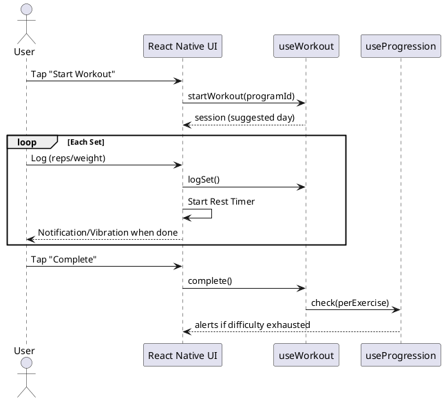

# Gym Tracker - Design Document

## 1. Technology

| Aspect | Decision |
|--------|----------|
| Users | Single-user |
| Platform | Mobile (React Native + Expo) |
| Language | TypeScript |
| Persistence | SQLite via expo-sqlite |
| Architecture | Screens → Hooks/Services → Repository → SQLite |

## 2. UI Design

### Navigation Structure

```
Tab Navigator
├── Home (Start Workout)
├── Programs
├── Exercises
├── History
└── Settings (Export/Import)
```

### Key Screens

| Screen | Purpose |
|--------|---------|
| `HomeScreen` | Quick-start workout, show active session if exists |
| `WorkoutScreen` | Active workout: current exercise, set logging, rest timer |
| `ProgramsScreen` | List programs, CRUD operations |
| `ProgramDetailScreen` | View/edit days and exercises |
| `ExercisesScreen` | Exercise library, CRUD operations |
| `HistoryScreen` | Past workout sessions list |
| `SettingsScreen` | Export/Import data as JSON |

**Workout Flow**: Start → Log Set → Rest Timer (countdown with notification) → Next Set → ... → Complete.

## 3. Types

```typescript
enum TrackingType {
  REPS = 'REPS',
  TIME = 'TIME',
}

enum ResistanceType {
  WEIGHT = 'WEIGHT',
  DIFFICULTY = 'DIFFICULTY',
}

enum WorkoutStatus {
  IN_PROGRESS = 'IN_PROGRESS',
  COMPLETED = 'COMPLETED',
  ABANDONED = 'ABANDONED',
}
```

## 4. Entities

### Definition Layer

```typescript
interface Exercise {
  id: number;
  name: string;
  description: string | null;
  defaultTrackingType: TrackingType;
  defaultResistanceType: ResistanceType;
  createdAt: string;
  updatedAt: string;
}

interface Program {
  id: number;
  name: string;
  description: string | null;
  lastCompletedDayId: number | null; // null = never started
  createdAt: string;
  updatedAt: string;
}

interface ProgramDay {
  id: number;
  programId: number;
  name: string;
  orderIndex: number;
}

interface ProgramDayExercise {
  id: number;
  programDayId: number;
  exerciseId: number;
  trackingType: TrackingType;
  sets: number;
  targetReps: number | null;        // null if TIME
  targetTimeSeconds: number | null; // null if REPS
  orderIndex: number;
}
```

### State Layer

```typescript
interface ExerciseSettings {
  id: number;
  exerciseId: number;
  // Weight-based
  currentWeight: number | null;
  weightIncreaseFactor: number | null;
  // Difficulty-based (user-managed ordered list)
  difficultyLevels: string[]; // e.g., ["Red", "Blue", "Green"]
  currentDifficultyIndex: number;
  restTimeSeconds: number | null;
  updatedAt: string;
}

interface WorkoutSession {
  id: number;
  programDayId: number; // NOT NULL - workouts require a program
  startedAt: string;
  completedAt: string | null;
  status: WorkoutStatus;
}

interface WorkoutSet {
  id: number;
  workoutSessionId: number;
  programDayExerciseId: number | null;
  exerciseId: number;
  setNumber: number;
  weight: number | null;
  difficulty: string | null; // Captured value at time of logging
  reps: number | null;
  timeSeconds: number | null;
  skipped: boolean;
}
```

## 5. SQL Schema

```sql
CREATE TABLE exercises (
    id INTEGER PRIMARY KEY AUTOINCREMENT,
    name TEXT NOT NULL,
    description TEXT,
    default_tracking_type TEXT NOT NULL,
    default_resistance_type TEXT NOT NULL,
    created_at TEXT NOT NULL DEFAULT CURRENT_TIMESTAMP,
    updated_at TEXT NOT NULL DEFAULT CURRENT_TIMESTAMP
);

CREATE TABLE programs (
    id INTEGER PRIMARY KEY AUTOINCREMENT,
    name TEXT NOT NULL,
    description TEXT,
    last_completed_day_id INTEGER REFERENCES program_days(id),
    created_at TEXT NOT NULL DEFAULT CURRENT_TIMESTAMP,
    updated_at TEXT NOT NULL DEFAULT CURRENT_TIMESTAMP
);

CREATE TABLE program_days (
    id INTEGER PRIMARY KEY AUTOINCREMENT,
    program_id INTEGER NOT NULL REFERENCES programs(id) ON DELETE CASCADE,
    name TEXT NOT NULL,
    order_index INTEGER NOT NULL
);

CREATE TABLE program_day_exercises (
    id INTEGER PRIMARY KEY AUTOINCREMENT,
    program_day_id INTEGER NOT NULL REFERENCES program_days(id) ON DELETE CASCADE,
    exercise_id INTEGER NOT NULL REFERENCES exercises(id) ON DELETE CASCADE,
    tracking_type TEXT NOT NULL,
    sets INTEGER NOT NULL,
    target_reps INTEGER,
    target_time_seconds INTEGER,
    order_index INTEGER NOT NULL
);

CREATE TABLE exercise_settings (
    id INTEGER PRIMARY KEY AUTOINCREMENT,
    exercise_id INTEGER UNIQUE NOT NULL REFERENCES exercises(id) ON DELETE CASCADE,
    current_weight REAL,
    weight_increase_factor REAL,
    difficulty_levels TEXT, -- JSON array: ["Red", "Blue"]
    current_difficulty_index INTEGER DEFAULT 0,
    rest_time_seconds INTEGER,
    updated_at TEXT NOT NULL DEFAULT CURRENT_TIMESTAMP
);

CREATE TABLE workout_sessions (
    id INTEGER PRIMARY KEY AUTOINCREMENT,
    program_day_id INTEGER NOT NULL REFERENCES program_days(id),
    started_at TEXT NOT NULL,
    completed_at TEXT,
    status TEXT NOT NULL DEFAULT 'IN_PROGRESS'
);

CREATE TABLE workout_sets (
    id INTEGER PRIMARY KEY AUTOINCREMENT,
    workout_session_id INTEGER NOT NULL REFERENCES workout_sessions(id) ON DELETE CASCADE,
    program_day_exercise_id INTEGER REFERENCES program_day_exercises(id),
    exercise_id INTEGER NOT NULL REFERENCES exercises(id),
    set_number INTEGER NOT NULL,
    weight REAL,
    difficulty TEXT,
    reps INTEGER,
    time_seconds INTEGER,
    skipped INTEGER NOT NULL DEFAULT 0
);

CREATE INDEX idx_workout_sets_session ON workout_sets(workout_session_id);
CREATE INDEX idx_workout_sets_exercise ON workout_sets(exercise_id);
```

## 6. Services / Hooks

| Service/Hook | Key Logic |
|--------------|-----------|
| `useWorkout` | Start/complete sessions, log sets, manage rest timer state |
| `useProgression` | Per-exercise: check last set → update weight OR advance difficultyIndex |
| `useProgramService` | CRUD, get next day (first incomplete or first if new) |
| `useExerciseService` | CRUD exercise library |
| `useImportExport` | JSON export/import. Refuse import if IN_PROGRESS session exists. |

### Progression Logic
- Invoked per-exercise on session complete.
- Skipped last set → no progression.
- Weight: `currentWeight += weightIncreaseFactor`.
- Difficulty: `currentDifficultyIndex++`. If at end, flag alert.

## 7. Diagrams

### Sequence: Complete Workout

