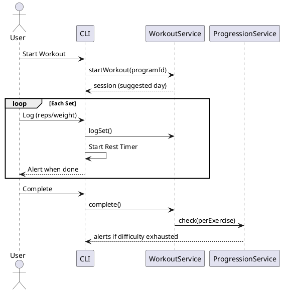

# Gym Tracker Java Port - Design Document

## 1. Technology

| Aspect | Decision |
|--------|----------|
| Users | Single-user |
| Platform | Terminal (CLI) |
| Persistence | SQLite via JDBC |
| Architecture | CLI → Service → Repository → SQLite |

## 2. CLI Design

```
=== Gym Tracker ===
1. Start Workout
2. Programs
3. Exercises
4. History
5. Export Data
6. Import Data
7. Exit
```

**Workout Flow**: Start → Rest Timer (active countdown with alert) → Next Set → ... → Complete.

## 3. Enums

```java
enum TrackingType { REPS, TIME }
enum ResistanceType { WEIGHT, DIFFICULTY }
enum WorkoutStatus { IN_PROGRESS, COMPLETED, ABANDONED }
```

## 4. Entities

### Definition Layer

```java
class Exercise {
    Long id;
    String name, description;
    TrackingType defaultTrackingType;
    ResistanceType defaultResistanceType;
    LocalDateTime createdAt, updatedAt;
}

class Program {
    Long id;
    String name, description;
    Long lastCompletedDayId; // NULL = never started
    LocalDateTime createdAt, updatedAt;
}

class ProgramDay {
    Long id, programId;
    String name;
    int orderIndex;
}

class ProgramDayExercise {
    Long id, programDayId, exerciseId;
    TrackingType trackingType;
    int sets;
    Integer targetReps;      // NULL if TIME
    Integer targetTimeSeconds; // NULL if REPS
    int orderIndex;
}
```

### State Layer

```java
class ExerciseSettings {
    Long id, exerciseId;
    // Weight-based
    Double currentWeight, weightIncreaseFactor;
    // Difficulty-based (user-managed ordered list)
    List<String> difficultyLevels; // e.g., ["Red", "Blue", "Green"]
    int currentDifficultyIndex;
    Integer restTimeSeconds;
    LocalDateTime updatedAt;
}

class WorkoutSession {
    Long id;
    Long programDayId; // NOT NULL - workouts require a program
    LocalDateTime startedAt, completedAt;
    WorkoutStatus status;
}

class WorkoutSet {
    Long id, workoutSessionId, programDayExerciseId, exerciseId;
    int setNumber;
    Double weight;
    String difficulty; // Captured value at time of logging
    Integer reps, timeSeconds;
    boolean skipped;
}
```

## 5. SQL Schema

```sql
CREATE TABLE exercises (
    id INTEGER PRIMARY KEY AUTOINCREMENT,
    name TEXT NOT NULL,
    description TEXT,
    default_tracking_type TEXT NOT NULL,
    default_resistance_type TEXT NOT NULL,
    created_at TEXT NOT NULL DEFAULT CURRENT_TIMESTAMP,
    updated_at TEXT NOT NULL DEFAULT CURRENT_TIMESTAMP
);

CREATE TABLE programs (
    id INTEGER PRIMARY KEY AUTOINCREMENT,
    name TEXT NOT NULL,
    description TEXT,
    last_completed_day_id INTEGER REFERENCES program_days(id),
    created_at TEXT NOT NULL DEFAULT CURRENT_TIMESTAMP,
    updated_at TEXT NOT NULL DEFAULT CURRENT_TIMESTAMP
);

CREATE TABLE program_days (
    id INTEGER PRIMARY KEY AUTOINCREMENT,
    program_id INTEGER NOT NULL REFERENCES programs(id) ON DELETE CASCADE,
    name TEXT NOT NULL,
    order_index INTEGER NOT NULL
);

CREATE TABLE program_day_exercises (
    id INTEGER PRIMARY KEY AUTOINCREMENT,
    program_day_id INTEGER NOT NULL REFERENCES program_days(id) ON DELETE CASCADE,
    exercise_id INTEGER NOT NULL REFERENCES exercises(id) ON DELETE CASCADE,
    tracking_type TEXT NOT NULL,
    sets INTEGER NOT NULL,
    target_reps INTEGER,
    target_time_seconds INTEGER,
    order_index INTEGER NOT NULL
);

CREATE TABLE exercise_settings (
    id INTEGER PRIMARY KEY AUTOINCREMENT,
    exercise_id INTEGER UNIQUE NOT NULL REFERENCES exercises(id) ON DELETE CASCADE,
    current_weight REAL,
    weight_increase_factor REAL,
    difficulty_levels TEXT, -- JSON array: ["Red", "Blue"]
    current_difficulty_index INTEGER DEFAULT 0,
    rest_time_seconds INTEGER,
    updated_at TEXT NOT NULL DEFAULT CURRENT_TIMESTAMP
);

CREATE TABLE workout_sessions (
    id INTEGER PRIMARY KEY AUTOINCREMENT,
    program_day_id INTEGER NOT NULL REFERENCES program_days(id),
    started_at TEXT NOT NULL,
    completed_at TEXT,
    status TEXT NOT NULL DEFAULT 'IN_PROGRESS'
);

CREATE TABLE workout_sets (
    id INTEGER PRIMARY KEY AUTOINCREMENT,
    workout_session_id INTEGER NOT NULL REFERENCES workout_sessions(id) ON DELETE CASCADE,
    program_day_exercise_id INTEGER REFERENCES program_day_exercises(id),
    exercise_id INTEGER NOT NULL REFERENCES exercises(id),
    set_number INTEGER NOT NULL,
    weight REAL,
    difficulty TEXT,
    reps INTEGER,
    time_seconds INTEGER,
    skipped INTEGER NOT NULL DEFAULT 0
);

CREATE INDEX idx_workout_sets_session ON workout_sets(workout_session_id);
CREATE INDEX idx_workout_sets_exercise ON workout_sets(exercise_id);
```

## 6. Services

| Service | Key Logic |
|---------|-----------|
| [WorkoutService](file:///home/gara/Documents/Proyects/ReactNative/gym-tracker-v2/old-src/services/WorkoutService.ts#6-184) | Start/complete sessions, log sets, trigger rest timer |
| `ProgressionService` | Per-exercise: check last set → update weight OR advance difficultyIndex |
| `ProgramService` | CRUD, get next day (first incomplete or first if new) |
| `ExerciseService` | CRUD exercise library |
| `ImportExportService` | JSON export/import. Refuse import if IN_PROGRESS session exists. |

### ProgressionService Logic
- Invoked per-exercise on session complete.
- Skipped last set → no progression.
- Weight: `currentWeight += weightIncreaseFactor`.
- Difficulty: `currentDifficultyIndex++`. If at end, flag alert.

## 7. Diagrams

### Sequence: Complete Workout

