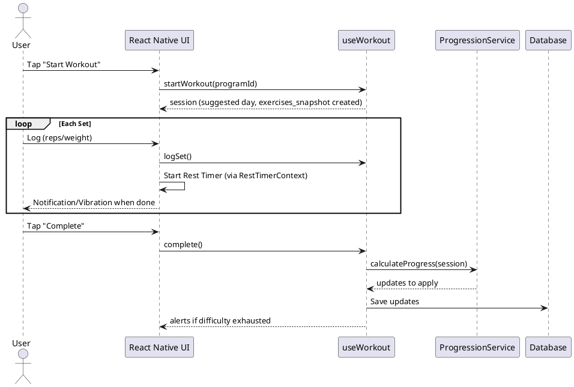
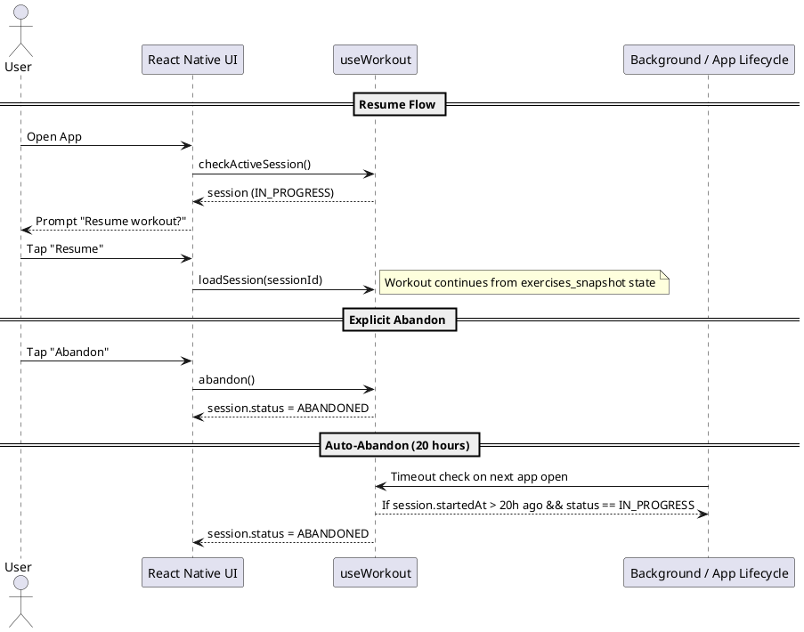

# Gym Tracker - Design Document

## 1. Technology

| Aspect | Decision |
|--------|----------|
| Users | Single-user |
| Platform | Mobile (React Native + Expo) |
| Language | TypeScript |
| Persistence | SQLite via expo-sqlite with Drizzle ORM |
| Architecture | Screens → Hooks (TanStack Query) → Repository → SQLite |

## 2. UI Design

### Navigation Structure

```
Tab Navigator
├── Home (Start Workout)
├── Programs
├── Exercises
├── History
└── Settings (Export/Import)
```

### Key Screens

| Screen | Purpose |
|--------|---------|
| `HomeScreen` | Quick-start workout, show active session if exists |
| `WorkoutScreen` | Active workout: current exercise, set logging, rest timer, progress indicator (e.g., "3/15 sets complete") |
| `ProgramsScreen` | List programs, CRUD operations |
| `ProgramDetailScreen` | View/edit days and exercises |
| `ExercisesScreen` | Exercise library, CRUD operations |
| `HistoryScreen` | Past workout sessions list. Tap an item for detailed view. |
| `SettingsScreen` | Export/Import data, weight unit preference |

### UI Constraints
**Read-Only Fields**: Fields that modify the underlying definition of an entity (e.g., an Exercise's `Default Tracking Type`) must be **greyed out/disabled** when viewed in a descendant context (e.g., within a Program Day list). This clarifies that the user is viewing an instance, not editing the global definition.

**Workout Flow**: Linear execution (Set 1 of Exercise A -> Set 2 of Exercise A -> ... -> Exercise B). Users can navigate back to skipped sets; the flow defaults to the next incomplete set but allows manual selection. Supersets are out of scope.
**Swap Exercise Flow**: In an active workout, the user can swap exercises (reorder or replace).
> **Note on Persistence**: Swaps are **persisted immediately** to the active session via the `exercises_snapshot`. The snapshot is generated when "Start Workout" is triggered and updated dynamically during the session. Resuming will restore the exact modified state.

## 3. Types

```typescript
enum TrackingType {
  REPS = 'REPS',
  TIME = 'TIME',
}

enum ResistanceType {
  WEIGHT = 'WEIGHT',
  DIFFICULTY = 'DIFFICULTY',
}

enum WorkoutStatus {
  IN_PROGRESS = 'IN_PROGRESS',
  COMPLETED = 'COMPLETED',
  ABANDONED = 'ABANDONED',
}
```

## 4. Entities

### Definition Layer

> **Architecture Note**: The interfaces below represent the **Domain Models** used by the UI and Application layer.
> The **Data Layer** types are inferred directly from the Drizzle Schema definitions (using `InferSelectModel`) and mapped to these Domain Models in the Repository layer. This decouples the application code from specific database implementation details.

```typescript
interface Exercise {
  id: string; // UUID
  name: string;
  description: string | null;
  defaultTrackingType: TrackingType;
  defaultResistanceType: ResistanceType;
  isArchived: boolean;
  createdAt: string;
  updatedAt: string;
}

interface Program {
  id: string; // UUID
  name: string;
  description: string | null;
  lastCompletedDayId: string | null; // null = never started
  createdAt: string;
  updatedAt: string;
}

interface ProgramDay {
  id: string; // UUID
  programId: string;
  name: string;
  orderIndex: number;
}

interface ProgramDayExercise {
  id: string; // UUID
  programDayId: string;
  exerciseId: string;
  trackingType: TrackingType;       // Set at creation, not overridable
  resistanceType: ResistanceType;   // Set at creation, not overridable
  sets: number;
  targetReps: number | null;        // null if TIME
  targetTimeSeconds: number | null; // null if REPS
  orderIndex: number;
}
```

### State Layer

> **Note**: Exercise settings are global—the same exercise shares settings across all programs.

```typescript
interface ExerciseSettings {
  id: string; // UUID
  exerciseId: string;
  // Weight-based
  currentWeight: number | null;
  weightIncreaseFactor: number | null;
  // Difficulty-based (user-managed ordered list)
  /** Stored as JSON string in DB; Repository layer handles parse/stringify */
  difficultyLevels: string[]; // e.g., ["Red", "Blue", "Green"]
  currentDifficultyIndex: number;
  restTimeSeconds: number | null;
  updatedAt: string;
}

interface WorkoutSession {
  id: string; // UUID
  programDayId: string | null; // Nullable; SET NULL on delete. Used for context in active sessions.
  programNameSnapshot: string | null; // Captured at start time for history preservation
  dayNameSnapshot: string | null;     // Captured at start time for history preservation
  exercisesSnapshot: ExerciseSnapshotItem[] | null; // Source of truth for history and active session state (swaps/order)
  startedAt: string;
  completedAt: string | null;
  status: WorkoutStatus;
}

/** Represents a single exercise entry in the exercises_snapshot JSON array */
interface ExerciseSnapshotItem {
  programDayExerciseId: string; // Reference to original ProgramDayExercise (for traceability)
  exerciseId: string;           // Denormalized for history queries when original is deleted
  exerciseName: string;         // Snapshot is source of truth for history display
  exerciseDescription: string | null;
  trackingType: TrackingType;
  resistanceType: ResistanceType;
  sets: number;
  targetReps: number | null;
  targetTimeSeconds: number | null;
  orderIndex: number;           // Captures order at snapshot time (including swaps)
}

interface WorkoutSet {
  id: string; // UUID
  workoutSessionId: string;
  exerciseId: string;
  setNumber: number;
  weight: number | null;
  difficulty: string | null; // Captured value at time of logging
  reps: number | null;
  timeSeconds: number | null;
  skipped: boolean;
  createdAt: string;
}
```

### Data Integrity & Logic Rules
1.  **orderedIndex Sequences**: The Repository layer is responsible for maintaining dense sequences for `orderIndex`. When an item is deleted or moved, the `orderIndex` of subsequent items must be recalculated to prevent gaps.
2.  **Timestamps**: All timestamps must be stored as **UTC ISO 8601 strings** (e.g., `2023-10-27T10:00:00.000Z`). The Repository layer sets `updatedAt` on UPDATEs. The UI logic is responsible for converting to local time for display.
3.  **Soft Deletes (Archiving)**: When a user requests to delete an exercise, the Repository layer first checks for associated history or program usage. If found, it performs an `UPDATE exercises SET is_archived = 1` instead of a physical `DELETE`. The UI must filter out archived exercises from active selection lists.

## 5. Database Schema

The database schema is managed via **Drizzle ORM**. This provides type safety and simpler migrations compared to raw SQL.

### Migration Strategy
Migrations are executed at app startup using the `drizzle-orm/expo-sqlite` `migrate` function. Migration SQL files are bundled using a Metro transformer or as raw assets. This ensures the schema is always up-to-date before any queries run.

### Naming Conventions
- **Tables**: `snake_case` (plural) in database.
- **Columns**: `snake_case` in database, mapped to camelCase properties in TypeScript.

### Data Types & Defaults
- **IDs**: `TEXT PRIMARY KEY`. **Must be generated on the application side** (e.g., `crypto.randomUUID()`) to ensure consistency across imports/exports and offline state.
- **Booleans**: Stored as `INTEGER` (0 = false, 1 = true).
- **Timestamps**: Stored as ISO 8601 Text. Defaults to `CURRENT_TIMESTAMP`.
- **JSON**: Complex objects (e.g., `difficulty_levels`, `exercises_snapshot`) stored as TEXT. Use Drizzle's `{ mode: 'json' }` option to automatically handle parsing/stringifying, ensuring type safety at the ORM level.

### Indexes
- `workout_sets`: Index on `workout_session_id` (foreign key performance).
- `workout_sets`: Index on `exercise_id` (analytics performance).


### Cascade Behavior Summary

| Parent Table | Child Table | Relationship | Behavior | Note |
|--------------|-------------|--------------|----------|------|
| programs | program_days | One-to-Many | CASCADE | Deleting program deletes all days |
| program_days | program_day_exercises | One-to-Many | CASCADE | Deleting day deletes planned exercises |
| exercises | program_day_exercises | Many-to-Many link | RESTRICT | Cannot delete exercise used in program (Archive instead) |
| exercises | workout_sets | One-to-Many | RESTRICT | Cannot delete exercise with history (Archive instead) |
| program_days | workout_sessions | One-to-Many | SET NULL | Deleting program/day preserves session history (orphaned sessions rely on snapshots) |
| workout_sessions | workout_sets | One-to-Many | CASCADE | Deleting session deletes its sets |

## 6. Custom Hooks

| Hook | Responsibility |
|------|-----------|
| `useWorkout` | Start/complete sessions, log sets, manage rest timer state. Calls `ProgressionService` on completion. |
| `ProgressionService` | **Pure Logic (Not a Hook)**. Accepts session data, determines next state. Per-exercise: check sets → update weight OR advance difficultyIndex. |
| `useProgramService` | CRUD, get next day (looping logic: `(last + 1) % total`) |
| `useExerciseService` | CRUD exercise library |
| `useImportExport` | JSON export/import. Refuse import if IN_PROGRESS session exists. |

### Progression Logic
- **Invoked per-exercise** on session complete (or when user exits).
- **Atomic Completion**: An exercise is considered "completed" for progression if all target sets were logged. **Constraint**: If any target set was marked "Skipped", progression is blocked for that exercise.
- **Resume**: If user exits mid-workout, state is saved. Resuming acts as if they never left.
- Weight: `currentWeight += weightIncreaseFactor` (only if target reps met on **all sets**).
- Difficulty: `currentDifficultyIndex++` (follows the same "All sets success" rule). If at end, flag alert.

## 7. State Management

**Approach**: **TanStack Query (React Query)** + Custom Hooks + React Context.

- **TanStack Query**: Handles all async data fetching, caching, loading states, and side-effect management (mutations).
  - Invalidates generic keys (e.g., `['programs']`) on mutations to ensure UI stays fresh.
- **React Context (`RestTimerContext`)**: Manages active rest timer state.
  - **Persistence**: The `targetEndTime` is synced to the active `WorkoutSession` in SQLite.
  - **Background Alerts**: Uses **Expo Notifications** to schedule local notifications with sound/vibration that fire even if the app is killed or suspended.
- **Persistence**: Repositories act as the "Query Function" for TanStack Query (e.g., `useQuery({ queryKey: ['exercises'], queryFn: ExerciseRepository.getAll })`).

This modernizes the stack and removes the complexity of manually managing `useEffect` loading waterfalls and cache invalidation.

### Error Handling

**Policy**:
1. **Development**: Complete error logging to console.
2. **User-Facing**: If a critical operation fails (e.g., `logSet` fails to write to DB), the app must show a native **Alert** (`Alert.alert`).
3. **State Sync**: Manual weight overrides during a session are persisted **immediately** to the `ExerciseSettings` table to ensure the change is captured even if the session is abandoned.

### Code Convention: Query Keys

To avoid string-matching bugs and ensure consistency, use a `QueryKeyFactory`:

```typescript
export const exerciseKeys = {
  all: ['exercises'] as const,
  lists: () => [...exerciseKeys.all, 'list'] as const,
  detail: (id: string) => [...exerciseKeys.all, 'detail', id] as const,
};
// Usage: useQuery({ queryKey: exerciseKeys.detail('uuid-string'), ... })
```

## 8. Data Interchange (JSON Schema)

```json
{
  "version": 1,
  "exportedAt": "2023-10-27T10:00:00Z",
  "exercises": [
    { "id": "uuid-1", "name": "Squat", "defaultTrackingType": "REPS", "isArchived": 0, ... }
  ],
  "programs": [
    { "id": "uuid-2", "name": "Starting Strength", "days": [ ... ] }
  ],
  "workoutSessions": [
    { "id": "uuid-3", "startedAt": "...", "sets": [ ... ] }
  ]
}
```

## 9. Diagrams

### Sequence: Complete Workout



### Sequence: Abandon / Resume Workout



> **Note**: All logging operations (`logSet`) must explicitly reference the `workoutSessionId` to ensure data integrity, especially when handling resumed sessions or modified exercise orders.