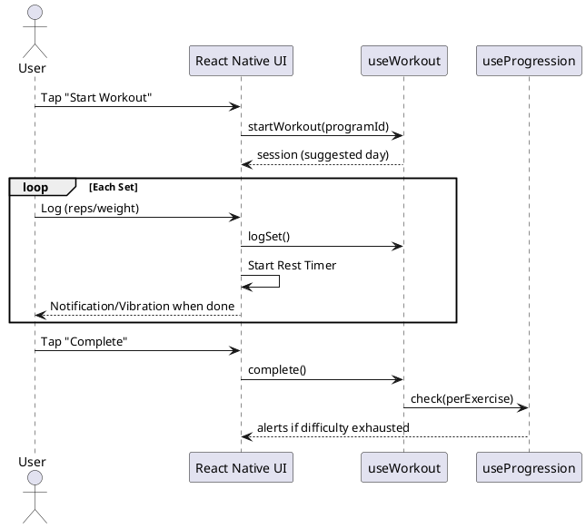

# Gym Tracker - Design Document

## 1. Technology

| Aspect | Decision |
|--------|----------|
| Users | Single-user |
| Platform | Mobile (React Native + Expo) |
| Language | TypeScript |
| Persistence | SQLite via expo-sqlite (with Drizzle ORM optional, or raw Repository layer) |
| Architecture | Screens → Hooks (TanStack Query) → Repository → SQLite |

## 2. UI Design

### Navigation Structure

```
Tab Navigator
├── Home (Start Workout)
├── Programs
├── Exercises
├── History
└── Settings (Export/Import)
```

### Key Screens

| Screen | Purpose |
|--------|---------|
| `HomeScreen` | Quick-start workout, show active session if exists |
| `WorkoutScreen` | Active workout: current exercise, set logging, rest timer |
| `ProgramsScreen` | List programs, CRUD operations |
| `ProgramDetailScreen` | View/edit days and exercises |
| `ExercisesScreen` | Exercise library, CRUD operations |
| `HistoryScreen` | Past workout sessions list |
| `SettingsScreen` | Export/Import data as JSON |

### UI Constraints
**Read-Only Fields**: Fields that modify the underlying definition of an entity (e.g., an Exercise's `Default Tracking Type`) must be **greyed out/disabled** when viewed in a descendant context (e.g., within a Program Day list). This clarifies that the user is viewing an instance, not editing the global definition.

**Workout Flow**: Linear execution (Set 1 of Exercise A -> Set 2 of Exercise A -> ... -> Exercise B). Supersets are out of scope.
**Swap Exercise Flow**: In an active workout, the user can swap exercises (reorder or replace).
> **Note on Persistence**: Swaps are **persisted** to the active session via an `exercises_snapshot`. Resuming will restore the exact state of the workout, including any reordered or replaced exercises.

## 3. Types

```typescript
enum TrackingType {
  REPS = 'REPS',
  TIME = 'TIME',
}

enum ResistanceType {
  WEIGHT = 'WEIGHT',
  DIFFICULTY = 'DIFFICULTY',
}

enum WorkoutStatus {
  IN_PROGRESS = 'IN_PROGRESS',
  COMPLETED = 'COMPLETED',
  ABANDONED = 'ABANDONED',
}
```

## 4. Entities

### Definition Layer

```typescript
interface Exercise {
  id: number;
  name: string;
  description: string | null;
  defaultTrackingType: TrackingType;
  defaultResistanceType: ResistanceType;
  createdAt: string;
  updatedAt: string;
}

interface Program {
  id: number;
  name: string;
  description: string | null;
  lastCompletedDayId: number | null; // null = never started
  createdAt: string;
  updatedAt: string;
}

interface ProgramDay {
  id: number;
  programId: number;
  name: string;
  orderIndex: number;
}

interface ProgramDayExercise {
  id: number;
  programDayId: number;
  exerciseId: number;
  trackingType: TrackingType;       // Set at creation, not overridable
  resistanceType: ResistanceType;   // Set at creation, not overridable
  sets: number;
  targetReps: number | null;        // null if TIME
  targetTimeSeconds: number | null; // null if REPS
  orderIndex: number;
}
```

### State Layer

> **Note**: Exercise settings are global—the same exercise shares settings across all programs.

```typescript
interface ExerciseSettings {
  id: number;
  exerciseId: number;
  // Weight-based
  currentWeight: number | null;
  weightIncreaseFactor: number | null;
  // Difficulty-based (user-managed ordered list)
  difficultyLevels: string[]; // e.g., ["Red", "Blue", "Green"]
  currentDifficultyIndex: number;
  restTimeSeconds: number | null;
  updatedAt: string;
}

interface WorkoutSession {
  id: number;
  programDayId: number; // NOT NULL - workouts require a program
  exercisesSnapshot: string | null; // JSON array preserving order/swaps for this specific session
  startedAt: string;
  completedAt: string | null;
  status: WorkoutStatus;
}

interface WorkoutSet {
  id: number;
  workoutSessionId: number;
  exerciseId: number;
  setNumber: number;
  weight: number | null;
  difficulty: string | null; // Captured value at time of logging
  reps: number | null;
  timeSeconds: number | null;
  skipped: boolean;
}

### Data Integry & Logic Rules
1.  **JSON Fields**: The Repository layer is responsible for `JSON.stringify` when writing and `JSON.parse` when reading fields like `exercise_settings.difficulty_levels`.
2.  **Timestamps**: The Repository layer must manually set `updatedAt = new Date().toISOString()` on every UPDATE operation. We will not use SQL triggers to keep the DB layer simple and portable.

```

## 5. SQL Schema

```sql
CREATE TABLE exercises (
    id INTEGER PRIMARY KEY AUTOINCREMENT,
    name TEXT NOT NULL,
    description TEXT,
    default_tracking_type TEXT NOT NULL,
    default_resistance_type TEXT NOT NULL,
    is_archived INTEGER NOT NULL DEFAULT 0,
    created_at TEXT NOT NULL DEFAULT CURRENT_TIMESTAMP,
    updated_at TEXT NOT NULL DEFAULT CURRENT_TIMESTAMP
);

CREATE TABLE programs (
    id INTEGER PRIMARY KEY AUTOINCREMENT,
    name TEXT NOT NULL,
    description TEXT,
    last_completed_day_id INTEGER REFERENCES program_days(id) ON DELETE SET NULL,
    created_at TEXT NOT NULL DEFAULT CURRENT_TIMESTAMP,
    updated_at TEXT NOT NULL DEFAULT CURRENT_TIMESTAMP
);

CREATE TABLE program_days (
    id INTEGER PRIMARY KEY AUTOINCREMENT,
    program_id INTEGER NOT NULL REFERENCES programs(id) ON DELETE CASCADE,
    name TEXT NOT NULL,
    order_index INTEGER NOT NULL
);

CREATE TABLE program_day_exercises (
    id INTEGER PRIMARY KEY AUTOINCREMENT,
    program_day_id INTEGER NOT NULL REFERENCES program_days(id) ON DELETE CASCADE,
    exercise_id INTEGER NOT NULL REFERENCES exercises(id) ON DELETE RESTRICT,
    tracking_type TEXT NOT NULL,
    resistance_type TEXT NOT NULL,
    sets INTEGER NOT NULL,
    target_reps INTEGER,
    target_time_seconds INTEGER,
    order_index INTEGER NOT NULL
);

CREATE TABLE exercise_settings (
    id INTEGER PRIMARY KEY AUTOINCREMENT,
    exercise_id INTEGER UNIQUE NOT NULL REFERENCES exercises(id) ON DELETE CASCADE,
    current_weight REAL,
    weight_increase_factor REAL,
    difficulty_levels TEXT, -- JSON array: ["Red", "Blue"]
    current_difficulty_index INTEGER DEFAULT 0,
    rest_time_seconds INTEGER,
    updated_at TEXT NOT NULL DEFAULT CURRENT_TIMESTAMP
);

CREATE TABLE workout_sessions (
    id INTEGER PRIMARY KEY AUTOINCREMENT,
    program_day_id INTEGER REFERENCES program_days(id) ON DELETE SET NULL, -- Nullable to allow program deletion while keeping history
    program_name_snapshot TEXT, -- Captured at start time to preserve history if program deleted
    day_name_snapshot TEXT,     -- Captured at start time
    exercises_snapshot TEXT,    -- JSON array of ordered exercise IDs/metadata. Handles swaps/reorder persistence.
    started_at TEXT NOT NULL,
    completed_at TEXT,
    status TEXT NOT NULL DEFAULT 'IN_PROGRESS'
);

CREATE TABLE workout_sets (
    id INTEGER PRIMARY KEY AUTOINCREMENT,
    workout_session_id INTEGER NOT NULL REFERENCES workout_sessions(id) ON DELETE CASCADE,
    exercise_id INTEGER NOT NULL REFERENCES exercises(id),
    set_number INTEGER NOT NULL,
    weight REAL,
    difficulty TEXT,
    reps INTEGER,
    time_seconds INTEGER,
    skipped INTEGER NOT NULL DEFAULT 0,
    created_at TEXT NOT NULL DEFAULT CURRENT_TIMESTAMP
);

CREATE INDEX idx_workout_sets_session ON workout_sets(workout_session_id);
CREATE INDEX idx_workout_sets_exercise ON workout_sets(exercise_id);
```

### Cascade Behavior Summary

| Parent Table | Child Table | Relationship | Behavior | Note |
|--------------|-------------|--------------|----------|------|
| programs | program_days | One-to-Many | CASCADE | Deleting program deletes all days |
| program_days | program_day_exercises | One-to-Many | CASCADE | Deleting day deletes planned exercises |
| exercises | program_day_exercises | Many-to-Many link | RESTRICT | Cannot delete exercise used in program (Archive instead) |
| program_days | workout_sessions | One-to-Many | SET NULL | Deleting program/day preserves session history (orphaned sessions rely on snapshots) |
| workout_sessions | workout_sets | One-to-Many | CASCADE | Deleting session deletes its sets |

## 6. Custom Hooks

| Hook | Responsibility |
|------|-----------|
| `useWorkout` | Start/complete sessions, log sets, manage rest timer state |
| `useProgression` | Per-exercise: check last set → update weight OR advance difficultyIndex |
| `useProgramService` | CRUD, get next day (last completed day index + 1) |
| `useExerciseService` | CRUD exercise library |
| `useImportExport` | JSON export/import. Refuse import if IN_PROGRESS session exists. |

### Progression Logic
- **Invoked per-exercise** on session complete (or when user exits).
- **Atomic Completion**: An exercise is considered "completed" for progression if all target sets were logged (skipped sets do not count as logged).
- **Resume**: If user exits mid-workout, state is saved. Resuming acts as if they never left.
- Weight: `currentWeight += weightIncreaseFactor` (only if target reps met on last set).
- Difficulty: `currentDifficultyIndex++`. If at end, flag alert.

## 7. State Management

**Approach**: **TanStack Query (React Query)** + Custom Hooks.

- **TanStack Query**: Handles all async data fetching, caching, loading states, and side-effect management (mutations).
  - Invalidates generic keys (e.g., `['programs']`) on mutations to ensure UI stays fresh.
- **Context**: Used strictly for *local* UI state that doesn't need persistence (e.g., "Active Rest Timer" state if it needs to persist across screens, though Zustand is also a viable option).
- **Persistence**: Repositories act as the "Query Function" for TanStack Query (e.g., `useQuery({ queryKey: ['exercises'], queryFn: ExerciseRepository.getAll })`).

This modernizes the stack and removes the complexity of manually managing `useEffect` loading waterfalls and cache invalidation.

### Code Convention: Query Keys

To avoid string-matching bugs and ensure consistency, use a `QueryKeyFactory`:

```typescript
export const exerciseKeys = {
  all: ['exercises'] as const,
  lists: () => [...exerciseKeys.all, 'list'] as const,
  detail: (id: number) => [...exerciseKeys.all, 'detail', id] as const,
};
// Usage: useQuery({ queryKey: exerciseKeys.detail(1), ... })
```

## 8. Data Interchange (JSON Schema)

```json
{
  "version": 1,
  "exportedAt": "2023-10-27T10:00:00Z",
  "exercises": [
    { "id": 1, "name": "Squat", "defaultTrackingType": "REPS", "isArchived": 0, ... }
  ],
  "programs": [
    { "id": 1, "name": "Starting Strength", "days": [ ... ] }
  ],
  "workoutSessions": [
    { "id": 101, "startedAt": "...", "sets": [ ... ] }
  ]
}
```

## 9. Diagrams

### Sequence: Complete Workout



> **Note**: All logging operations (`logSet`) must explicitly reference the `workoutSessionId` to ensure data integrity, especially when handling resumed sessions or modified exercise orders.